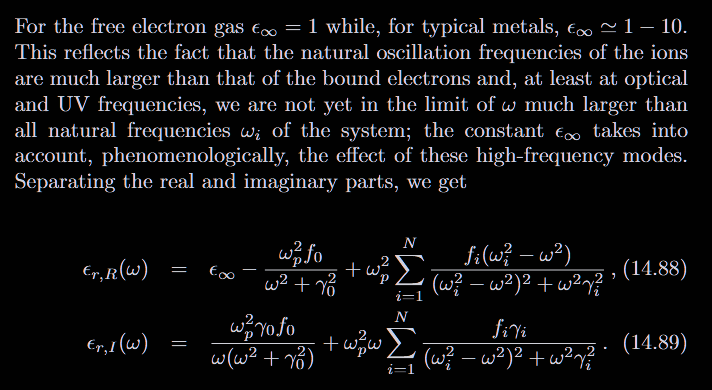

# Electromagnetic Media

From fourier:

$$
\mathbf{j}_{free}(\omega) = \sigma(\omega) \mathbf{E}(\omega) \\
\mathbf{j}^*_{free}(\omega) = \mathbf{j}_{free}(-\omega) \\
\mathbf{E}^*(\omega) = \mathbf{E}(-\omega) \\
\therefore \sigma^*(\omega) = \sigma(-\omega) \\
\sigma = \sigma_{R} + i \sigma_{I} \\
$$

The relation requieres that:
$$
\sigma_R(\omega) = \sigma_R(-\omega) \\
\sigma_I(\omega) = -\sigma_I(-\omega) \\
$$

Energy relation would indicate property of $\sigma$

$$
\frac{d \mathcal{E}}{d V} = \int^\infty_{-\infty}dt \mathbf{E}(t) \cdot \mathbf{j}_{free}(t)
$$

While product in one domain equal the convolution in another domain, with no variable in final results means $i(\omega+\omega'-\omega'')t$ for which $\omega''$ equal zero as the "should-be" variable:

$$
\frac{d \mathcal{E}}{d V} = \int^\infty_{-\infty}d\omega \mathbf{E}(\omega) \mathbf{E}(-\omega)(\sigma_{R} + i\sigma_{I}) \\
= \int d\omega |\mathbf{E}|^2(\omega)(...)
$$

We know that electric field is the even function related to frequency because we don't have a real physical relation to negative frequency. However, that's just a another phrase for time, which negative time isn't real, we must start from initial, if that's the symmetry comes to play, we can extend the whole electric field as a symmetry related to time or frequency.

So, due to the odd property of $\sigma_I$, we leave only $\sigma_R$.

Transforming back, the free variable will results convolution with a free variable:

$$
\mathbf{j}_{free}(t) = \int^\infty_{-\infty}dt' \sigma(t-t') \mathbf{E}(t')
$$

We can see usual relation in ohm is just $\sigma_0 \delta(t-t')$.

However, infinite time integral violate casuality, we know that the effect of past must before $t$, so $t' \lt t$. Integral is with the upper bound $t$ rather $infty$. Integral is with the upper bound $t$ rather $\infty$. That's mean $\sigma(t-t') = 0 \quad t' > t \to \sigma(t) = 0 \quad 0 > t$.

$\sigma$ should be will defined in upper complex plane with a nice convergence property. Second, $\sigma$ shouldn't has any singularity on real axis which violate physical property. Also, we know that if there's a singularity in upper plane $e^{-\omega_It}$ in fourier transformation will give a strong convergence. So it must be analytic on whole upper plane.
$$
\mathbf{P}\int^\infty_{-\infty} d \omega' \sigma(\omega')\frac{1}{\omega'-\omega} - i\pi \sigma(\omega) = 0 \\
$$
Gives:
$$
\frac{1}{\pi}\mathbf{P}\int^\infty_{-\infty} d \omega' \sigma_{I}(\omega')\frac{1}{\omega'-\omega} - \sigma_R(\omega) = 0 \\
-\frac{1}{\pi}\mathbf{P}\int^\infty_{-\infty} d \omega' \sigma_{R}(\omega')\frac{1}{\omega'-\omega} - \sigma_I(\omega) = 0 \\
$$

We know $\sigma_R$ is even and $\sigma_I$ is odd, we can divide the negative and positive part, and use the relation to sum up.

Suppose $\sigma_R(\omega') \to 0 \quad \omega' \to \infty$. Then we know that the most contribution comes from $\omega' \ll \omega$ if $\omega \to \infty$. Which is high frequency limit:

$$
\sigma_I(\omega) \approx \frac{2}{\pi \omega}\int_0^\infty d\omega' \sigma_R(\omega')
$$

Such approximation is valid only if $\sigma_R$ converge faster than $\omega^{-1}$. Is this possible? Observe that:

$$
\sigma_R(\omega=0) = \frac{2}{\pi}\int_0^\infty d\omega' \frac{\sigma_I(\omega')}{\omega'}
$$
Which is valid only if $\sigma_I$ converge faster than $\omega^{-1}$.

As for $\sigma_R$, we see $\sigma_I$ is odd. Which means:

$$
\sigma_I(\omega')\frac{1}{\omega'-\omega} - \sigma(\omega')\frac{1}{-\omega'-\omega} \\
= \sigma_I(\omega')\frac{2\omega'}{\omega'^2 - \omega^2} \approx \sigma_I(\omega')\frac{2\omega'}{\omega^2}
$$

Suppose $\sigma_I = \omega^{-\alpha}$ with $\omega \to \infty $ and $\to \text{constant}$ with $ \omega \to 0$ Now we know that:
$$
\sigma_R \sim \omega^{-2} (\sigma_I \omega') d\omega' \\
\sigma_R \sim \omega^{-2} \\
$$

If we folllow the same routine, then $\sigma_I \sim \omega^{-1}$, which doesn't converge, how? Then, the real situation would be two case:

- not only converge but also vanish! So $\sigma_I \sim \omega^{-3}$(due to odd function)
- roughly a coefficient to impede:
  - $\frac{1}{1+\omega}$ couldn't, still diverge!
  - $\frac{\omega}{1+\omega^2}$ could **converge!**

The same observation can be applied to $\epsilon$, but it doesn't converge to $0$ rather $\epsilon_0$ in large time response. So the contour integral doesn't converge. Rather, $\chi(\omega)$ does so.

## Drude-Lorentz for Bound Electron

Bound electron would be modeled as a damping oscillator around its stable position.

But **real** behavoir should be describled by quantum mechanics!

$$
\ddot{x} + \gamma_0\dot{x} + \omega^2_0 x = - e E(t)/m_e \\
(-\omega^2 - i\omega\gamma_0 + \omega_0^2)\tilde{x}(\omega) = - e \tilde{E}(\omega)/m_e \\
\tilde{d}(\omega) = -ex(t) = \frac{e^2}{m_e}\frac{1}{ - \omega^2 - i\omega\gamma_0 + \omega_0^2}\tilde{E}(\omega) \\
P(\omega) = n_b \tilde{d}(\omega)
$$

Which gives:
$$
\chi(\omega) = \omega_p^2 (...) \\
\omega_p^2 = \frac{n_be^2}{\epsilon_0 m_e} \\
$$

However, a improvement is to account for a multiple different energy state as discrete sum.
$$
\epsilon_r(\omega) = 1 + \omega_p^2 \sum_i p_i (...)(\omega_i,\gamma_i)
$$

Where $p_i$ is the probability, so $\sum_i p_i = 1$

The dielectric behavoir can be observed from:
$$
\epsilon_r(\omega=0) = 1 + \omega_p^2/\omega_0^2 > 1
$$

The pole of the dominator:
$$
\omega_{\pm} = \pm \sqrt{\omega_0^2 - (\gamma/2)^2} - i\frac{\gamma}{2} \\
\chi_e(t) \propto e^{\pm i\phi - \frac{\gamma}{2}t}
$$
Where $\phi$ is phase factor.

However, in high frequency limit, the thing is different(The integral isn't trivial, but we can observed from the limit of $\sigma$):
$$
\epsilon_{r,R}(\omega) = 1 - \frac{\omega_p^2}{\omega^2} \\
\epsilon_{r,I}(\omega) = \frac{\omega_p^2 \gamma}{\omega^3}
$$

Where in lowest order, the $\epsilon_r$ is real.

An interesting thing is:
$$
\epsilon_{r,R} = 1 - \frac{2}{\pi \omega^2}\int^\infty_0 d \omega' \omega' \epsilon_{r,I}(\omega') = 1-\frac{\omega_p^2}{\omega^2} \quad (\omega \to \infty) \\
\int_0^\infty (...) = \frac{\pi}{2}\omega_p^2
$$
Which known as $f$-sum rule.

### Drude for Moving Electron

Suppose a friction $\gamma_0$ expressed as $1/\tau_0$ as average collision time.

$$
\frac{d v(t)}{d t} + \frac{v(t)}{\tau} = \frac{-e E(t)}{m_e} \\
j_{free}(t) = -e n_f v(t)
$$

Where $v(t)$ is the average velocity.

$$
-i \omega j_{free}(\omega) + \frac{j(\omega)}{\tau} = \frac{n_fe^2}{m_e} E(\omega) \\
j_{free}(\omega) = \sigma(\omega)E(\omega) \\
\sigma(\omega) = \frac{n_f e^2 \tau}{m_e}\frac{1}{1-i\omega \tau} = \sigma_0 \frac{1}{(...)} \\
\sigma(\omega = 0) = \sigma_0
$$

We know that $\sigma(\omega)$ is analytical in upper plane(but not the lower plane) and converges. So it satisfy **Kramers–Kronig relations**.

$$
\sigma(t) = \int_{-\infty}^\infty d\omega/2\pi \sigma(\omega) e^{-i\omega t}
= \sigma_0 \int (...) = \sigma_0 e^{-t/\tau}
$$

Where we know that:

$$
j_{free}(t) = n_f e^2/m_e \int_{-\infty}^t d t' e^{-(t-t')/\tau}E(t') \\
$$
if $E(t')$ is constant.
$$
j_{free}(t) = \sigma_0 E_0
$$

In high frequency limit, we see that:
$$
\sigma_R(\omega) = \frac{\sigma_0}{\omega^2 \tau^2} \\
\sigma_I(\omega) = \frac{\sigma_0}{\omega \tau}
$$

## Synthesis

Combine two case above, we could describe a general case:
$$
-i \omega \rho_{free}(\omega,\bold{x}) + \nabla \cdot \mathbf{j}_{free}(\omega,\bold{x}) = 0 \\
\nabla \cdot \mathbf{D} = \frac{1}{i \omega} \nabla \cdot \mathbf{j}_{free} \\
\epsilon_b(\omega) \mathbf{E} = \mathbf{D}(\omega) \\
\sigma(\omega) \mathbf{E} = \mathbf{j}_{free}(\omega) \\
$$

Results:
$$
\nabla \cdot (\epsilon_b(\omega) + \frac{i}{\omega}\sigma(\omega))\mathbf{E} = 0 \\
\nabla \cdot \epsilon \mathbf{E} = 0
$$
Where we absorb everything into $\mathbf{E}$.

$$
\epsilon_r = 1 + \chi + i\sigma/\omega
$$
$$
\epsilon_r(\omega) = 1 - \frac{n_f e^2}{\epsilon_0 m_e}(...) + \frac{n_b e^2}{\epsilon_0 m_e}\sum_i (...)
$$

Define a general coefficient:
$$
\omega_p^2 = \frac{ne^2}{\epsilon_0 m_e} \\
n = n_f + n_b \\
f_0 = n_f / n \quad f_i = (n_b/n)(f_b)_i \quad \gamma_0 = 1/\tau \\
\epsilon_r(\omega) = 1 - \omega_p^2 \sum_{i=0}^N \frac{f_i}{\omega_i^2 - \omega^2 - i\omega \gamma_i}
$$

We know previously that Drude model cause a movement of electron as current even in $\omega = 0$. So due to a multiplication of $\omega^{-1}$, it becomes a real axis pole which must be subtracted.

We know that:
$$
\frac{d \mathcal{E}}{d t d V} \propto \sigma_R \mathbf{E}^2 \\
\text{or} \\
\mathbf{E} \frac{\partial \mathbf{D}}{\partial t} \\
= \mathbf{E}^2 (-i \omega \epsilon_0 \epsilon_r(\omega))
\text{we choose real part:} \\
= \mathbf{E}^2 \omega \Re(i\epsilon_0\epsilon_r) \\
= \omega \mathbf{E}^2 \epsilon_0 \epsilon_{r,I}
$$

Which the dissipation comes from $\epsilon_I$

Second thing is:
$$
k = \frac{\omega n }{c} \\
n^2 \propto \epsilon_r \\
r \propto |\frac{1-\sqrt{\epsilon_r}}{1 + \sqrt{\epsilon_r}}|^2  = |\frac{1-n_R-in_I}{1 + n_R+in_I}|^2 \\
= |\frac{1-n_R^2 - n_I^2 }{(1+n_R)^2 + n_I^2}| = |\frac{1-\epsilon_R -2n_I^2}{1+ \epsilon_R + 2n_I^2}| \\
n_{R}^2 - n_I^2 = \epsilon_R \\
2 n_{R} n_I = \epsilon_I \\
$$

So if $\epsilon_r < 0$, $n = i\kappa$ which is decaying wave, otherwise it oscillates as a propagation. When there's a imaginary part of $\epsilon_r$, both part will contains. We see if $\epsilon_R \to 1$, $r \to 0$

Now observe:

- Low or zero frequency(infrared/micro wave):

Imaginary part blows up and real part reaches a huge negative constant.

Which means a strong absorption in the media itself due to imaginary part. And a excellent reflection behavoir. Why seems contradictory? Because the first one is inner media, while second is on the surface media. That indicates only few light will transmit into metal and absorb hugely. (The transmitted distance often called **skin depth**).

- Intermediate frequency($\omega \approx \omega_p$)

Which also called **Plasma frequency region**. There are many spikes in these region which is also the oscillation mode. Visible light is below or near the range, which $\epsilon_R$ near zero or negative and $\epsilon_I$ decreases. However, interband absorption in $\sum_i(...)$ will gives selection of light. Resulting different colors.

- High frequency($\omega \gg \omega_i, \omega_p$)

$\epsilon_I$ goes down as $\omega^{-3}$ which indicates vanishing absorption.(electron can't follow up to the oscillation to absorb energy).

$\epsilon_R \to \epsilon_\infty$ which is positive, so metals becomes transparent to high frequency.
