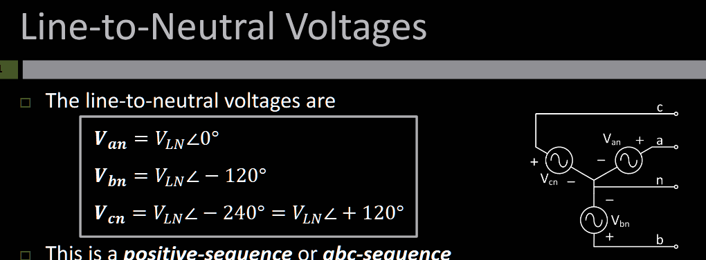
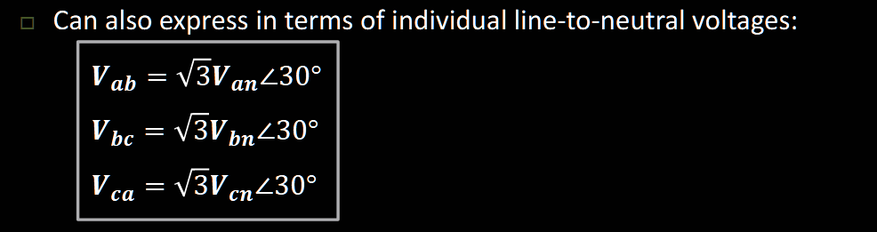
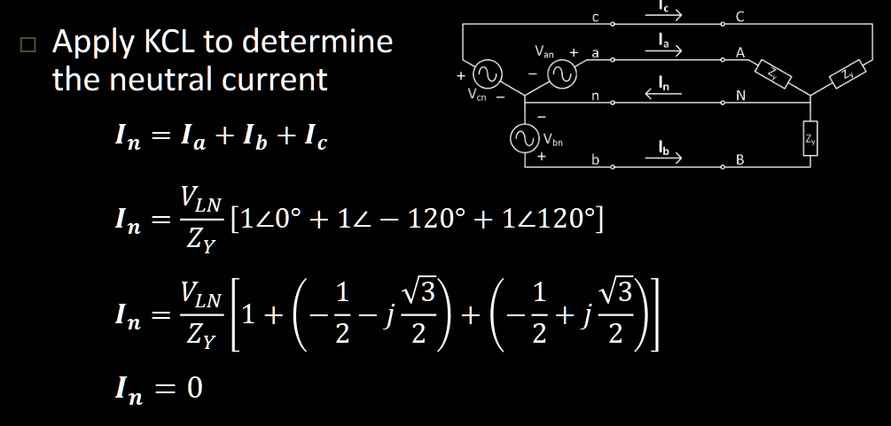
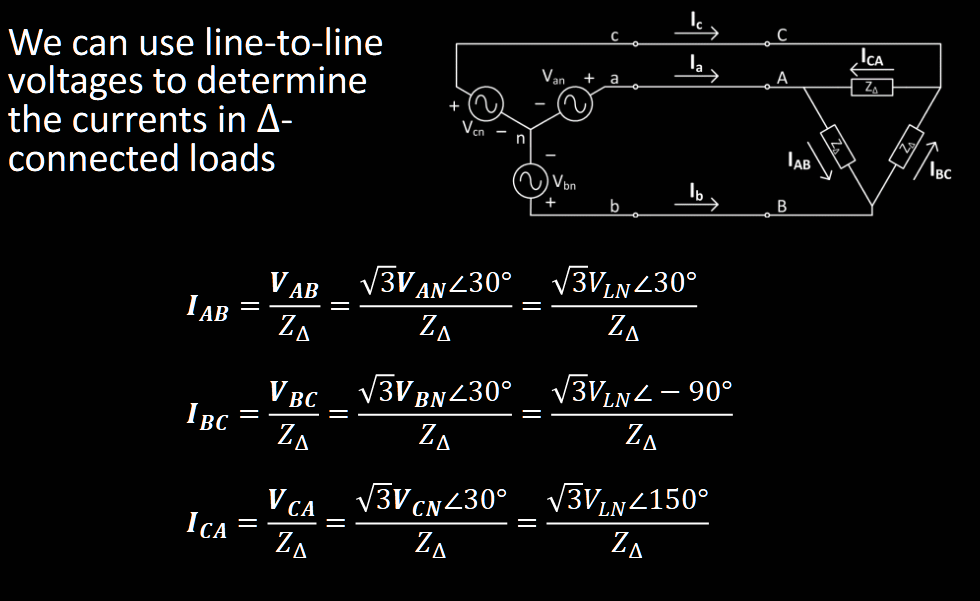
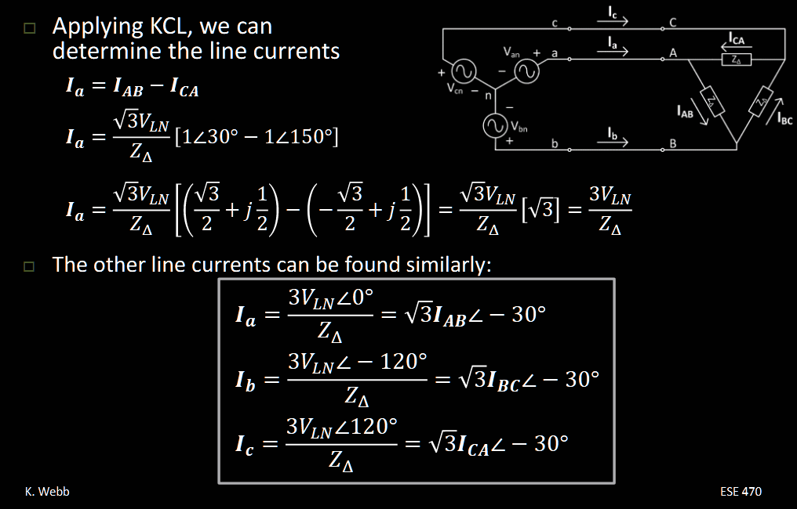
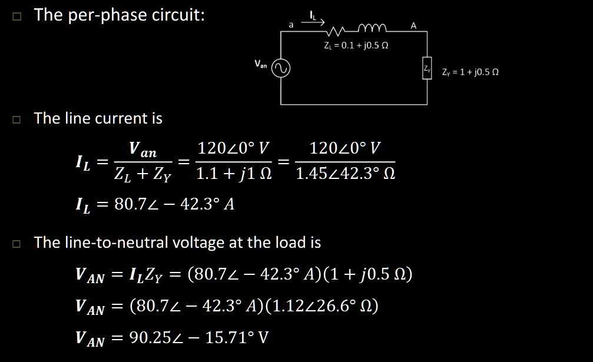
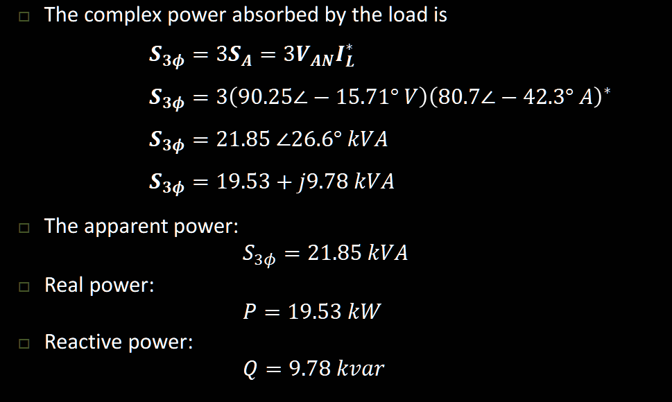

# AC Circuits

$$
p = vi^* = p_{real} cos(\delta-\beta) + ip_{reactive}cos(\delta-\beta)
$$

In which $cos(\delta-\beta)$ called **power factor**,aka **$p.f.$**, and $|p|$ called **apparent power**

$$
S = P+jQ \\
p.f. = cos(\delta-\beta) = P/S
$$

We restrict:

$P>0 \quad Q>0$ as absorbed by element
$P<0 \quad Q<0$ as supplied by element

$$
S_{resistor} = VI^* = Ve^{i\delta}V/R \, e^{-i\delta} = V^2/R \\
S_{capacitor} = V\angle\delta \, (-j\omega CV\angle-\delta) = -j\omega CV^2 \\
S_{inductor} = V\angle\delta \, (\frac{V}{-j\omega L}\angle-\delta) = jV^2/\omega L
$$

To achieve power factor correction for high $Q$, we will add a parallel capacitor.

First we delve into parallel situation.

$$
P = UI^* = U(U^*\sum_i\frac{1}{Z_i}) \\
= U^2 \sum_i (G_i + jY_i) \\
= \sum_i (P_i + jQ_i) \\
$$

Suppose we know previous $p.f.$ and final $p.f.'$, we can do this.

$$
\Delta Q = P(tan\phi_1 - tan\phi_2) = Q_c \\
X_c = U^2/Q_c = 1/(\omega C) \\
C = Q_c/(U^2 \omega) = \frac{P}{U^2 \omega} (tan\phi_1 - tan\phi_2)
$$

## 3 Phase

$V_{LN}$ is the neutral voltage, we call each is **line-neutral** voltage, we call each voltage difference is the **line-line** voltage, both concept can be applied to load side.

$$
\begin{align}
V_{ab} &= V_{an}+V_{nb} = V_{N}-V_{N}\angle-120 \degree \\
 &= V_{N}[1-(-\frac{1}{2} - j\frac{\sqrt{3}}{2})] \\
 &= V_{N}[\frac{3}{2} - j\frac{\sqrt{3}}{2}] \\
 &= \sqrt{3}V_{N}\angle 30 \degree \\
V_{bc} &= \sqrt{3}V_{N}\angle -90 \degree \\
V_{ca} &= \sqrt{3}V_{N}\angle 150 \degree
\end{align}
$$

Permutation relation:

You see that for Line current:
in Y-connected load:
$$
I_{Y} \propto V_{LN}
$$

in $\triangle$-connected load:
$$
I_{\triangle} \propto 3V_{LN}
$$

thus if $I_{Y} = I_{\triangle} $:
$$
Z_{Y} = \frac{Z_{\triangle}}{3}
$$

For power:
$$
\text{shift every by phase} \\
p \propto VI^{*} = V_{LN}I_{L}\angle(\delta+\phi-(\beta + \phi)) \\
p_{3\phi} = 3V_{LN}I_{L}cos(\delta-\beta) + j3V_{LN}I_{L}sin(\delta-\beta) \\
$$

Constant real power!

