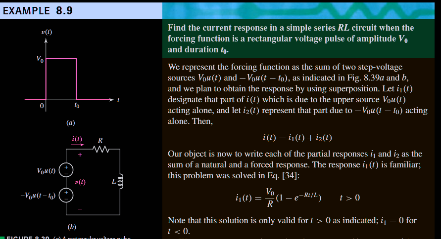
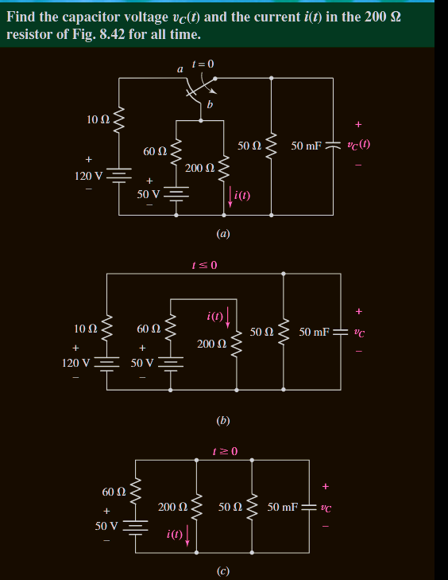
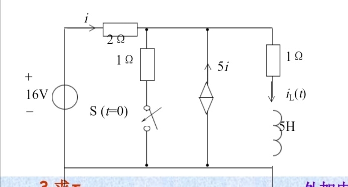

# Transient Circuits

deduce $i_2(t)$

$i_2(t) = -\frac{V_0}{R}(1-e^{-Rt/L}) \quad t > t_0$

plugin into

$i(t) = 0 \quad t<0$
$i(t) = i_1(t) \quad 0 < t < t_0$
$i(t) = i_1(t) + i_2(t-t_0) = \frac{V_0}{R}e^{-Rt/L}(e^{Rt_0/L} - 1) \quad t > t_0 $

$$
\begin{align}
v_c(0) &= \frac{50}{50 + 10} \times 120 = 100 \, \mathbf{V} \\
v_c &= v_{cf} + v_{cn} \\
R_{eq} &= \frac{1}{\frac{1}{50} + \frac{1}{200} + \frac{1}{60}} = 24 \, \mathbf{\Omega} \quad v_{cn} = A e^{-t/(R_{eq}C)} \\
v_{Cf} &= 50 \left( \frac{200 \parallel 50}{60 + 200 \parallel 50} \right) = 20 \, \mathbf{V} \\
100 &= 20 + A \quad \text{(at } t = 0 \text{)} \\
v_c &= 20 + 80 e^{-t/1.2}
\end{align}
$$

before:
$$
\begin{align}
\frac{v-16}{2}-5i+\frac{v}{1} &= 0\\
i &= -\frac{v-16}{2} \\
v &= 12 \, V \\
i_c(0^-) &= \frac{v}{1} = 12 \, A
\end{align}
$$

take $V_x$ and $I_x$ to test impedance(you could take $V_x = 0$ to get $I_x = i_L(\infin)$!)

$$
\begin{align}
\frac{v-16}{2} + \frac{v}{1} - 5i + I_x &= 0 \\
i &= -\frac{v-16}{2} \\
\frac{v-V_x}{1} &= I_x \\
V_x &= -((5/4)I_x-12) \\
R_{eq} &= 5/4 \\
\tau &= L/R_{eq} = 4 \\
\text{take} \, V_x &= 0 \, get \\
i_L(\infin) &= 48/5 \\
i_L(t) &= 48/5 + (48/5 - 12)e^{-t/4}
\end{align}
$$
