# Research Plan: Representation, Relativistic Fields, and Particle Extraction

Status: active tracked research graph; relocation verified  
Primary source manuscript: `physics/quantum-mechanics/relativistic-representations.typ`  
Companion synthesis: `physics/quantum-mechanics/field-equations-to-computable-observables.md`  
Architecture: [results/manuscript-architecture.md](results/manuscript-architecture.md)
Migration: [results/manuscript-migration-plan.md](results/manuscript-migration-plan.md)

## Active synthesis horizon

The finite free-field spine is frozen as research baseline `R1` for composition.
The original Typst note remains the source worktable; supported results are now
promoted into `physics/quantum-mechanics/poincare-to-free-fields.typ` through the
two-pass migration contract. Research reopens only for a missing manuscript
bridge, an incompatible theorem contract, or a failed recovery check. Countable
completion and the interacting/observable branches remain separate research
horizons and do not block the scoped paper. "Separate" now means preserved in the
tracked Markdown research graph, not deferred to an unspecified paper and not left
only in an ignored worktable.

## Durable research-record decision

The whole worktable is the canonical research record, not the node prose alone.
Its graph, framework, source contracts, computation packets and programs, synthesis
results, and nodes form one evidence-preserving unit. Migrating only Markdown nodes
would sever the path

```text
source contract / executable check
  -> compact evidence packet
  -> node construction
  -> graph edge
  -> synthesis result or manuscript claim.
```

The tree was relocated once, without manufacturing a second mirror, to this
directory. The internal layout and relative links were retained:

```text
plan.md
framework.md
sources.md
sources/
nodes/
computation/
results/
```

The directory count is not itself bloat: these layers own different information.
Bloat means two files claiming ownership of the same derivation, source extraction,
computation result, or synthesis decision. The migration removes only generated
cache material and later compresses repeated summaries by linking to their
canonical owner; it does not discard failed routes or merge unlike layers.

Typst manuscripts are derived syntheses of supported sub-spines:

- `poincare-to-free-fields.typ` presents the scoped free-field theorem;
- `../field-equations-to-computable-observables.md` is the Markdown companion
  synthesized from the supported N4n--N9g path without replacing its nodes;
- exploratory routes, negative results, changes of viewpoint, and open boundaries
  remain first-class Markdown nodes even when no paper consumes them.

The relocation includes live executable calculations because they are evidence
bindings, not prose duplication. Generated caches and reproducible bulk run output
are excluded. The content staging tree has been emptied; link, execution-path, and
rendered-manuscript verification remain the closure conditions.

## Target

Given any `s,h in (1/2)N_0`, construct a local free field realization of the
corresponding massive spin or massless helicity representation, then compare
alternative tensor, spinor, potential, curvature, and group-function realizations.
Every claimed realization must recover the specified little-group representation
on its physical solution fiber.

The interacting continuation reverses the construction: given a field dynamics,
extract stable particle representations from its translation spectrum, relate a
prepared mechanical bound pole to a covariant composite shell, and state when the
output is instead a resonance or infraparticle. This continuation audits and
generalizes the manuscript spine. Its supported route is synthesized in the
Markdown companion, while the Typst paper retains the free-field theorem boundary.

The global continuation now treats a field equation as an intermediate
realization, not a predictive endpoint. It separates the later choices of action,
quantum algebra, state, dynamics, observable, and reduction, then asks how bounded
mechanics, scattering particles, resonances, and collective response are recovered
from those choices. N4z now joins the finite half-integer local causal form to its
positive CAR representation, while N8 constructs diffusion as the first
same-observable collective reduction, N8a evaluates it exactly in an interacting
stochastic lattice gas, N8b computes one nonlinear rare-current law, and N8c
constructs the first coherent-quantum-to-SSEP recovery. N8d then tests that
recovery on a complete operational two-time charge distribution. N9 returns from
that regression leaf to the global question: it decides whether an observable-
selected quotient is invariant, memory-bearing, or autonomous only after a scale
limit. “First” and “second” quantization name useful restricted
constructions; they do not impose an ontological ladder.

Read the global spine by semantic operation rather than by node number:

```text
representation and symmetry
  -> admissible state content and covariance
  -> local field realization/equation
  -> action, quantum algebra, state, and full dynamics
  -> operational preparation or observable constructs a selector
  -> test selector against the full evolution
       |-> invariant: autonomous bound/particle sector
       |-> noninvariant: exact memory/self-energy, then bound pole or resonance
       |-> scale-separated: collective Markov closure
       `-> asymptotic intertwiner: scattering
  -> recover the same named observable and audit whole-route cost.
```

`N4y/N4z` close the exact free quantization/recovery loops across this diagram;
`N8/N8a/N8b/N8c` develop the state-dependent collective branch, N8d is its finite
recovery regression, N9 distills the common dynamics of all selectors, N9a
evaluates the shared memory/self-energy object across one threshold, N9b
compares multiple constructions of its coupling-visible spectrum, N9c derives
the first such measure from a regulated field Hamiltonian as a complete
coefficient through `g^2`, and N9d turns its continuum boundary into a finite-time
detector event. N9e then closes the previously missing scalar provenance edge by
constructing that fiber from the massive scalar shell, a declared field smear,
and conserved total momentum. N9f tests the remaining computation-to-prediction
edge: it certifies the ground energy and a bounded short-time detector window,
then proves that the same norm route is vacuous at N9d's `t=80` rate probe. N9g
reconstructs the resulting kinetic-scale law from the same measure: the law is
supported for an exact one-excitation comparator, while an explicit multiparticle
remainder and recoil cross term block its unqualified transfer to N9e's exclusive
detector.
None replaces the diagram with a quantization-first spine.

The manuscript follows one deductive spine. Nodes preserve the research questions
and evidence behind it; they are not manuscript sections or execution gates.

## How to read the nodes

Follow the main line once from left to right:

```text
N1: what symmetry can determine
  -> N2: the spaces on which representations act
       |-> N2a: physical spin/helicity fiber at one momentum
       `-> N2b: Lorentz carriers constructed by invariant Hodge splitting
  -> N3: match the N2a fiber with an N2b carrier
  -> N4: a local equation for every finite spin/helicity
       |-> N4m: one executable field machine for symmetric integer spins --\
       `-> N4i: half-integer adjoint and causal response
            `-> N4j: half-integer causal source/solution quotient
                 `-> N4k: positive particle/antiparticle completion
                      `-> N4l: support-preserving faithfulness ---------------+-> N4y
                                                                            `-> N4z
  -> N5: bounded low-spin comparison by physical recovery strength
  -> N6: potential resolutions, countable completion, and economy
  -> N7: which notions of equivalence survive stronger demands
       (R1 synthesis closed; stronger deformation and prediction claims reopen it).
```

`N4d` is the algebraic computability continuation of N4. It consumes N3/N4's
physical cohomology and N4c's action-side obligations, then asks what extra data
would promote rational symbol inverses to compatible Green distributions and
observable calculations. `N4e` completes the first bounded analytic case: the
classical Maxwell complex on Minkowski spacetime. `N4f` then tests spin two and
finds that the same invariant completion proves a causal theorem for every separate
finite symmetric integer spin. This is not yet a countable-spin completion; N4d,
N4e, and N4f sharpen N7's equivalence tests at distinct strengths. `N4g` then
constructs the missing positive-frequency norm and identifies the completed
compact-source space with a closed invariant subrepresentation of N3's induced
Hilbert space. `N4h` proves that the norm is faithful on N4f's support-sensitive
causal quotient. Density in the whole induced space remains one exact theorem.
For the symmetric integer-spin branch, read `N4m` first: it distills N4a/N4c/N4f/
N4g/N4h into five objects, four identities, and one source-to-particle computation.
For the half-integer branch, `N4i` constructs the missing complex pairing, Euler
representative, wave reduction, and admissible causal response. `N4j` then proves
that compact admissible sources modulo Euler sources are exactly spacelike-compact
solutions modulo gauge. `N4k` constructs the positive spinor-screen metric and
separates future particle from conjugate-past antiparticle data. `N4l` proves that
its norm is faithful by constructing one spacelike-compact gamma-traceless gauge
parameter. `N4z` then proves on the same compact source pair that this positive
two-shell form is the normalized local causal Euler form and hence the CAR real
form. Density in the full induced space remains the exact open theorem.
[N5](nodes/05-low-spin-comparison.md) now evaluates spins `0,1/2,1,3/2,2`
through one recovery contract. It proves the massless Weyl/Dirac block identity,
the Maxwell potential/curvature shell isomorphism, and the supported orbitwise
comparisons, while refusing unproved massive Rarita--Schwinger, Fierz--Pauli, and
local curvature/potential equivalences.
The longer nodes are proof packets, not prerequisites for understanding the route.

The [computability endpoint audit](results/05-computability-endpoint-audit.md)
tests this spine against propagators and bound-state spectra. It finds a uniform
free-response reduction for every separate finite symmetric massless potential,
but not for the distinct massive chiral family. [N4o](nodes/04o-dirac-coulomb-local-graph.md)
now constructs the parity-paired massive Dirac operator from the old Clifford
map, its external `U(1)` deformation, the curvature obstruction to scalar Green
reuse, the static Coulomb Hamiltonian, its distinguished-domain contract, and its
manifest `SU(2)` reduction. The gap multiplicity operators, eigenvalues and
projectors were left open. [N4p](nodes/04p-dirac-angular-reduction.md) constructs
the conventional `kappa` block decomposition invariantly and preserves an exact
spectral-measure recovery map. Its audit now rejects this as the sought
computational reduction: `a,b` generate `Cl_2(C)~=M_2(C)`, so the residual fiber
is the old gamma subblock up to basis change, and the polar map still chooses
radial coordinates. Only magnetic multiplicity has been removed. Any stronger
relation remains a bounded discovery probe before radial separation.

[N4n](nodes/04n-algebraic-spectrum-bridge.md) corrects both the radial-first backend
and the attempt to replace it with a bounded algebra specification. Oscillator,
Coulomb, inverse-square, quartic and integrable-model probes use incompatible
constructive mechanisms. They are counterexamples, not a complete portfolio. The
only supported common structure is an open reduction-graph audit: name the
observable, invent problem-local transformations, verify each semantic witness
and recovery map, compose only matching edges, count the whole route, and retain
an edge only when it improves accuracy, cost or reuse. N4n's exact Schur complement separately
explains the mechanics/field split as a sector-and-threshold distinction rather
than separate physics.

[N4q](nodes/04q-semantic-computability.md) supplies the missing global view. A
field equation is a presentation; computation is a verified factorization from
admissible inputs to one named observable. It separates invertible reformulation,
block decomposition, semantic compression, and certified approximation. Its
Schur-commutant theorem proves that manifest symmetry fixes degeneracy but leaves
multiplicity dynamics arbitrary. N4m's scalar Green reuse is the positive
free-field witness; N4p's radial gamma subblock is the negative interacting
witness. Bound states, continuum response, scattering, and field-sector
elimination are then distinct queries and reductions of one spectral dynamics.

[N4r](nodes/04r-field-mechanics-stability.md) constructs the field/mechanics
bridge that this view left open. A preparation is an isometric injection of a
common mechanical space into each field Hilbert space. Exact sector elimination
then identifies its projected resolvent with an energy-dependent mechanical
operator and reconstructs the full dressed field state. Gauss' law constructs the
finite-source Coulomb representative; source, recoil, and radiative variations
enter one effective kernel. A contour identity bounds the change of the prepared
bound-cluster projector without a radial or gamma-subblock calculation. The
abstract bridge is supported, while one UV-controlled evaluation of its
self-energy and whole-route cost remains open.

[N4s](nodes/04s-field-particle-extraction.md) generalizes from prepared mechanics
to the field/particle relation. N3 begins with a Wigner representation and embeds
it into a free field realization; N4s reverses the question by projecting
field-created states onto sharp components of the interacting translation
spectrum. Quotienting interpolators with zero shell amplitude constructs the
particle Hilbert space and its Poincare action. The same operation treats
elementary and composite stable particles; Haag--Ruelle limits add scattering,
while resonances and Gauss-law infraparticles are explicitly different output
types. N4r's static bound level becomes a particle only after a dynamical source,
covariant total-momentum pole branch, and stability/asymptotic construction are
supplied.

[N4t](nodes/04t-neutral-composite-same-state.md) performs that first dependent
test in a translation-invariant neutral atom--radiation model. A finite-rank
dressed-atom eigenbundle is the common object: the prepared mechanical resolvent
detects its spectral weight (a pole residue only when isolated), the full
decomposable projector selects its field state,
and the zero-photon Rayleigh wave-operator channel returns the same state. The
test corrects N4r at a massless threshold—ordinary Schur recovery may fail and
must be replaced by spectral-projection recovery—and it exposes rather than hides
the remaining relativistic gaps: no boosts and no local vacuum-to-atom
interpolator.

[N4u](nodes/04u-effective-mass-route-audit.md) performs the first cost-sensitive
prediction test on N4t's branch. Direct differentiation gives one full reduced-
resolvent response; scalar Feshbach differentiation gives a root problem and
reusable complementary tangent solves. Exact isospectrality proves that they
compute the same Hessian. The comparison rejects a generic cost advantage for
self-energy notation, but a controlled order-`g^2` reduction succeeds: the full
field calculation contracts to one positive atomic-resolvent momentum integral,
which predicts weak-coupling mass enhancement.

[N4v](nodes/04v-relativistic-mass-shell.md) closes the relativistic kinematic
bridge without assuming a free dispersion. If N4r's exact rest pole becomes
N4s's sharp, stable, field-accessible single Poincare orbit, spectral covariance
transports the same state over the positive mass shell. Its invariant equation
then constructs the entire dispersion and proves that orbit mass, rest energy,
and curvature mass coincide. An exact rational identity recovers the
nonrelativistic kinetic energy with a quartic error bound. This is genuine
compression of momentum dependence, but it leaves the existence, stability,
renormalization, and numerical value of the rest pole to dynamics.

[N4w](nodes/04w-sine-gordon-breather-rest-pole.md) performs the first evaluated
relativistic composite test. A candidate audit selects the sine-Gordon first
breather / massive-Thirring neutral bound state because one exact bootstrap model
simultaneously supplies a soliton--antisoliton pole, a stable neutral shell, and
nonzero local-field form factors. Continuing the two-body invariant to the pole
computes `m_1/M_s=2 sin(pi xi/2)`; the residue constructs the fusion map, and
N4v propagates the rest mass over the shell. The result is supported within exact
factorized-scattering/form-factor contracts, while full constructive locality and
transfer to nonintegrable `3+1`-dimensional composites remain open.

[N4x](nodes/04x-nonintegrable-composite-robustness.md) now tests which parts of
that result survive without factorization. At `xi=1/5`, the relevant second
harmonic `cos(2 beta phi)` preserves Poincare symmetry, reflection, every old
vacuum value, and the local single-soliton channel while generically breaking
integrability. Form-factor perturbation reduces the first soliton and breather
mass tangents to two crossed diagonal scalars; certified mass bounds then give an
explicit threshold-gap radius, and N4v fixes the deformed shell. The paired
half-frequency deformation preserves the same manifest symmetries but has a
nonzero semilocal annihilation residue and confines the old soliton. Thus shell
shape, spectral isolation, residue factorization at one stable pole, and local
access are portable; elastic factorization and the exact trigonometric mass
formula are not. Numerical form factors and continuum remainder bounds remain
the next computation.

[N4y](nodes/04y-quantization-recovery-bridge.md) closes the free bosonic
quantization/recovery loop and places it inside the larger spine. N4g's faithful
causal source quotient constructs the CCR field on symmetric Fock space; applying
that field to the vacuum produces exactly the same future-shell vector, so N4s's
free spectral extractor recovers the original one-particle representation on the
same source class. The antisymmetric Fock functor likewise recovers N4k's
particle/antiparticle space. [N4z](nodes/04z-fermionic-car-coincidence.md) closes
the former all-rank local obligation: admissibility annihilates the gauge lift,
trace reversal is identity on the physical screen representative, and one null
Clifford homotopy converts the causal shell pairing into N4k's positive metric.
Interacting Fock space is retained only as an asymptotic construction from N4s's
stable shell. N4r's bounded sector, N4s's scattering sector, resonances, and
collective response are different observable selectors downstream of
the algebra, state, and dynamics—not different equations or successive
quantizations. [N8](nodes/08-collective-diffusion-response.md) constructs the
first collective instance from a microscopic conserved density. Continuity and
the leading electrochemical constitutive map reduce its response to `chi` and
`sigma`, recover the same density correlator at hydrodynamic order, and expose
microscopic transport evaluation and the remainder bound as the real open work.
[N8a](nodes/08a-ssep-exact-collective-regression.md) performs that work for SSEP:
the exclusion generator closes exactly on mean density, computes
`chi=sigma_cond=rho(1-rho)` and `D=1`, and compares the exact lattice response
with continuum diffusion through an explicit second-order symbol bound. The same
Bernoulli equilibrium constructs a density rate function with Hessian `chi^(-1)`;
the stochastic, rather than unitary-quantum, scope remains explicit.
[N8b](nodes/08b-ssep-current-large-deviation.md) then evaluates one nonlinear
observable rather than appending a general fluctuation formalism. Conservation
identifies the bond current with a half-line density change; exponential tilting
and convex duality define its scaled cumulant and rate functions; the exact SSEP
theorem compresses the MFT path optimization to
`mu_rho(lambda)=F(2rho(1-rho)(cosh(lambda)-1))`. The second and fourth cumulants,
Gaussian center, cubic tail, and scalar Legendre computation are thereby explicit.
The result also locates the computational boundary: hydrodynamics constructs the
path problem, while SSEP integrability evaluates it.
[N8c](nodes/08c-dephased-quantum-ssep.md) then adds the missing quantum comparator.
A coherent nearest-neighbor fermion current is an exact eigen-observable of local
occupation dephasing, so its equilibrium covariance and one scalar Green--Kubo
integral give `D=2J^2/gamma`. Occupation pinching constructs the monitored pointer
probabilities, and the strong-monitoring Schur/Zeno map produces SSEP with the same
bond rate. The coefficient equality is exact in the declared convention, while
full N8b statistics transfer only to the monitored pointer process after ordered
Zeno, infinite-line, and large-time limits—not to the unconditional finite-
dephasing Lindblad state.
[N8d](nodes/08d-two-time-quantum-charge.md) constructs that omitted endpoint
observable rather than assigning a classical path to the Lindblad state. Two
measurements of the right-subsystem charge produce a five-point characteristic
law on an isolated four-site chain. At fixed Zeno time, its full distribution,
variance, and fourth cumulant converge to the same-input finite SSEP event as
`gamma` grows. This closes the finite-system observable bridge but deliberately
does not identify it with N8b's unbounded infinite-line current or QD-04's
reservoir-jump current. It is retained as a regression leaf.
[N9](nodes/09-observable-dynamics.md) then returns to the common global problem.
For a retained-data map `q` and full evolution `T_t`, it proves that one future
observable factors through `q` exactly when `ker q` is invisible to that
observable, while autonomous reduced dynamics requires the stronger invariance
`T_t ker q subset ker q`. When invariance fails, direct elimination constructs
the exact initial-correlation and memory terms; their Laplace transform is N4r's
self-energy. This classifies N4s's sharp particle shell as invariant, N4r's
prepared mechanics as memory-bearing, and N8c's population quotient as Markovian
only after the Zeno scale limit.
[N9a](nodes/09a-threshold-spectral-measure.md) evaluates that common object rather
than adding another formal reduction. A positive coupling measure is constructed
from the departure vector into one continuum; its Fourier transform gives exact
memory and its Stieltjes transform gives the bound pole or continuum boundary.
One explicit density verifies atom-plus-continuum normalization below threshold,
unitary one-channel boundary response above it, and a divergent first memory
moment that rejects the simplest Markov estimate. The rank-one consequences are
cheap. N9c now closes the first bounded construction cost at order `g^2`; exact
finite-coupling and physical-atom measures remain open.
[N9b](nodes/09b-coupling-measure-routes.md) keeps that frontier branched. It first
proves that the smallest reducing field sector generated by the access map preserves
every memory, self-energy, and Euclidean return while all orthogonal field directions
are invisible. It then compares symmetry-channel, resolvent, real-time,
moment/Lanczos, Euclidean, and form-factor routes to the same operator-valued
measure. An exact two-site regression shows why finite moments work at short time
and far off spectrum but fail at the threshold and long time. The positive-measure
spine is also explicitly stopped at a generic nonself-adjoint collective
Liouvillian unless an additional weighted-self-adjoint bridge is constructed.
[N9c](nodes/09c-field-derived-coupling-measure.md) closes the first bounded branch.
Vacuum departure from a massive scalar field fiber constructs, rather than
prescribes, a radial one-boson measure through order `g^2`. Its Stieltjes,
Fourier, moment-chain, and continuum-boundary transforms recover the same bound
shift, residue, mass curvature, threshold tail, and channel loss. The regression
also rejects two overclaims: the exact finite-coupling measure still contains the
interacting Fock problem, and a continuum boundary is not a full scattering
matrix.
[N9d](nodes/09d-operational-bound-open-channel.md) closes that boundary-to-event
gap without changing Hamiltonians. A two-dimensional ground/excited preparation
constructs one operator-valued departure measure. Its ground entry gives a bound
shift, residue, and curvature mass; its excited entry gives the complete
order-`g^2` emitted-boson probability. Survival loss, memory curvature, and the
on-shell boundary rate are checked on the same event. Exponential decay,
resonance, and an `S` matrix remain explicitly different output types.
The [field-to-observable synthesis audit](results/06-field-to-observable-synthesis-audit.md)
now prevents this continuation from being misread as one uninterrupted derivation.
The relativistic worktable supports an exact free realization/quantization module;
N9c/N9d support a scalar interacting benchmark. The bounded
[N9e scalar interaction-provenance bridge](nodes/09e-scalar-interaction-provenance.md)
now constructs that benchmark from the massive scalar shell, its N4y Fock field,
a declared spatial profile, and exact total-momentum reduction. This closes the
same-model scalar interface while preserving the decisive limitation: symmetry
does not select the profile, internal system, or coupling, and the mobile body is
not relativistic. The free paper should still end at this typed interface; N9e is
a companion model bench, not a universal continuation theorem.
[N9f certified observable window](nodes/09f-certified-observable-window.md) then
tests whether that companion benchmark predicts rather than merely expands. A
combined internal/field-parity quotient and scalar Feshbach equation certify the
ground energy; an exact three-vertex Duhamel remainder certifies the one-boson
event only at finite time. This mixed result is the branch stop: the bound and
short-time routes compress the whole computation, while `t=80` requires a new
phase-sensitive kinetic or resonance construction if a lifetime is requested.
[N9g kinetic-scale reconstruction](nodes/09g-kinetic-scale-reconstruction.md)
opens exactly that bounded re-entry. The coupling-free departure measure constructs
one complex generator whose real and imaginary parts give decay and phase. An
internally constructed one-excitation Friedrichs comparator recovers the bounded
exponential event and N9d's tangent. The exact N9e fiber does not yet inherit this
law: combined parity permits higher even/odd Fock sectors, and its recoil term is
not an additive second-quantized reservoir energy. N9g therefore returns a precise
multiparticle suppression obligation rather than calling the comparator a proof
of the exclusive full-model detector.

The exact object passed along each arrow is:

| From | Object passed forward | Why it is needed next |
| --- | --- | --- |
| `N1 -> N2` | chosen Poincare group, energy/orbit scope, and nondetermined choices | types the representations without claiming unique dynamics |
| `N2 -> N2a` | momentum orbit `O`, standard momentum `k`, and stabilizer `K_k` | constructs the internal particle label |
| `N2 -> N2b` | oriented Lorentz space and chosen spin cover | constructs the Hodge ideals, spinor cover, and finite carrier functors |
| `N2a/N2b -> N3` | `V_sigma` and the explicit `K_k`-map `j_sigma:V_sigma->Res_(K_k)F` | constructs the orbitwise particle-to-field intertwiner |
| `N3 -> N4` | little-group intertwiner or cohomology isomorphism | converts fiber equivalence into a covariant orbit realization |
| `N4/N3a/N3b/N4o -> N5` | universal low-spin symbols, independently supported vector branches, and the invariant massive Dirac factorization | classifies each comparison by its strongest constructed recovery map |
| `N4/N5 -> N6` | uniform finite-label family plus alternative-carrier costs | tests countable completion and computational economy |
| `N5/N6 -> N7` | explicit maps, kernels, gauge images, locality, and assumptions | distinguishes representation equivalence from stronger equivalences |
| `N3/N4/N4c -> N4d` | physical cohomology, finite symbol complexes, and pairing/adjoint/source data | constructs the bounded algebraic interface and states the still-open Green-distribution obligations |
| `N3b/N4c/N4d -> N4e` | helicity-one quotient, variational duality, and Green-compatibility obligations | constructs the first causal source-to-solution quotient |
| `N4a/N4c/N4e -> N4f` | uniform bosonic complex, trace reversal/source duality, and the Maxwell causal method | proves causal source/solution equivalence for every separate finite symmetric integer spin |
| `N2/N2a/N3/N4a/N4f -> N4g` | positive orbit and measure, induced helicity fiber, screen cohomology, and real causal source quotient | constructs the positive norm, complex structure, and closed one-particle image |
| `N4g -> N4h` | zero future-shell amplitude and the real spacelike-compact causal solution | constructs one support-preserving gauge parameter and proves faithfulness |
| `N4b/N4c -> N4i` | spinor-tensor complex, Bianchi operator, and fermionic trace-reversal candidate | proves the adjoint identities, wave reduction, and admissible causal response |
| `N4i -> N4j` | constrained adjoint, Bianchi, gauge-wave, and field-wave identities | proves injectivity and surjectivity of the support-sensitive causal quotient map |
| `N2/N2a/N3/N4b/N4i/N4j -> N4k` | positive orbit measure, induced target, spinor-screen cohomology, first-order response, and complex causal quotient | constructs the positive particle/antiparticle shell map and isolates its faithfulness and density boundaries |
| `N4k -> N4l` | zero particle and antiparticle screen amplitudes | constructs one spacelike-compact gamma-traceless gauge parameter and proves faithfulness |
| `N4c/N4d -> N4n` | constructed dynamics plus resolvent/observable contracts | compares heterogeneous reductions by witness, recovery, cost and error; unifies point and continuous spectral regimes without prescribing a solver |
| `N2a/N2b/N3/N4/N4b/N4c/N4i/N4d/N4n -> N4o` | massive rest fiber, Lorentz/Clifford carrier, realization criterion, scalar shell, Dirac pairing, background/resolvent obligations and reduction-edge audit | constructs the massive Dirac operator, `U(1)` curvature obstruction, distinguished static Coulomb Hamiltonian, gap observable and rotation multiplicity reduction |
| `N2a/N2b/N4b/N4o -> N4p` | rest rotations, fundamental spin carrier, Clifford normal action, distinguished central Hamiltonian and unresolved rotation multiplicities | constructs the angular block equivalence, then exposes `Cl_2(C)~=M_2(C)` and radial-coordinate dependence as obstructions to calling it a new computational reduction |
| `N3/N4d/N4m/N4n/N4o/N4p -> N4q` | realization criterion, observable interface, free scalar-factorization witness, open reduction audit, interacting Coulomb target, and angular-block obstruction | constructs observable-relative semantic computability, the equivalence/compression hierarchy, the manifest-symmetry insufficiency theorem, and the unified spectral/sector view |
| `N4o/N4q -> N4r` | external electrostatic Dirac representative, domain and gap observable, plus the same-observable compression and field-sector elimination contract | constructs mechanics as a prepared field observable, exact state recovery, the Gauss-law source bridge, and a stable bound-cluster projector estimate |
| `N3/N4g/N4h/N4k/N4l/N4r -> N4s` | particle-to-field intertwiner, faithful free shell quotients, and the prepared field/mechanics pole with recovery | constructs the reverse field-created spectral particle quotient, its covariance and asymptotic regimes, and the composite-particle lift obligations |
| `N4r/N4s -> N4t` | prepared fiber resolvent and the field/mechanics/particle same-state target | constructs one neutral dressed-atom band, proves spectral/preparation/asymptotic state coincidence, and isolates the missing Poincare/vacuum-interpolator lift |
| `N4r/N4t -> N4u` | exact Schur equation, dressed band, preparation, and effective-mass target | constructs direct and self-energy Hessians, proves their same-branch equality, audits whole-route cost, and reduces the leading weak-coupling correction to an atomic resolvent integral |
| `N2/N4r/N4s/N4t/N4u -> N4v` | massive-orbit construction, exact rest pole, sharp field-created particle quotient, nonrelativistic comparison band, and curvature/cost target | constructs interacting single-orbit shell closure, proves orbit/rest/curvature mass coincidence, and recovers the nonrelativistic kinetic observable with an exact error witness |
| `N4r/N4s/N4v -> N4w` | prepared-channel semantics, field-created particle/access criteria, and rest-pole shell propagation | selects an executable relativistic neutral-composite model, computes its exact breather mass ratio and stability gap, and joins pole fusion to local-field access on one shell |
| `N4s/N4v/N4w -> N4x` | shell-access criterion, Poincare propagation, and the exact breather reference data | constructs a nonintegrable channel-preserving deformation, first mass tangent, stability budget, and a confining counter-deformation that identifies the integrability boundary |
| `N4g/N4h/N4k/N4l/N4r/N4s -> N4y` | faithful free shell maps, causal/positive forms, prepared mechanical response, and interacting spectral extraction | constructs the free quantization--recovery diamond, isolates the fermionic CAR-locality equality for N4z, and places bounded, scattering, and collective outputs in the global view |
| `N4i/N4j/N4k/N4l/N4y -> N4z` | local causal Euler form, admissible quotient, faithful positive two-shell form, and isolated normalization obligation | proves causal-Euler/shell/CAR coincidence and graded locality after one overall action normalization |
| `N4q/N4s/N4y -> N8` | observable-relative compression, the sharp-shell particle comparator, and the named-observable recovery contract | constructs diffusion from a conserved density and recovers its leading microscopic response without calling the dissipative pole a particle |
| `N8 -> N8a` | conserved-density response, symbolic transport coefficients, and same-observable remainder obligation | evaluates the exact SSEP lattice response, all transport data, continuum error, and equilibrium large-deviation curvature |
| `N8a -> N8b` | local exchange/current convention, exact coefficients, equilibrium initial cost, and MFT trajectory action | changes from N8a's ring to the theorem's infinite line, then constructs the tilted current, exact non-Gaussian scaled cumulants, Legendre rate function, and integrability boundary |
| `N8/N8a/N8b -> N8c` | collective-response contract, SSEP coefficients, and the named current hierarchy | constructs coherent hopping plus dephasing, computes exact quantum diffusion, recovers the SSEP pointer process, and separates unconditional, monitored, and two-time current observables |
| `N8b/N8c -> N8d` | integrated-cut event, dephased channel, exact diffusion scale, Zeno generator, and observable distinction | constructs the finite two-measurement charge law, compares the complete quantum and SSEP distributions on identical inputs, and separates finite, infinite-line, and reservoir-current limits |
| `N4q/N4r/N4s/N8/N8c/N8d -> N9` | observable compression, prepared self-energy, invariant particle shell, hydrodynamic and Zeno closures, and one endpoint recovery regression | proves observable-factor and autonomous-descent criteria, constructs exact memory/resolvent alternatives, classifies the prior branches, and identifies the threshold-memory field/mechanics frontier |
| `N4n/N4r/N4s/N9 -> N9a` | atom/continuum unity, departure measure, dressing recovery, particle/scattering regimes, and the common memory/self-energy transform | constructs and evaluates one positive coupling measure below and above threshold, checks spectral normalization and boundary unitarity, and exposes the non-Markov first-moment obstruction |
| `N4u/N4w/N4x/N8/N8c/N9a -> N9b` | atom-field resolvent structure, integrable and deformed form-factor branches, real-time collective response, nonnormal counterexample, and one exact scalar measure | proves minimal coupling-visible cyclic compression, compares six routes to an operator-valued measure, evaluates finite-moment and Euclidean information loss, and retains several observable-dependent field probes |
| `N4u/N9a/N9b -> N9c` | regulated field fiber and mass response, same-measure bound/open target, cyclic compression, and route-specific refusals | derives the order-`g^2` measure from field departure, evaluates four routes on one model, and locates the exact-Fock and scattering boundaries |
| `N9/N9c -> N9d` | exact memory semantics, field-derived measure, and unresolved continuum-boundary meaning | constructs a two-level operator-valued measure, a finite-time emitted-boson event, probability/memory/boundary coincidence, and the resonance/scattering stop |
| `N4/N4y/N9c/N9d -> N9e` | massive scalar shell, Fock field/vacuum injection, and the benchmark Hamiltonian/measure as a recovery target | constructs the profile-to-shell map, self-adjoint full model, conserved total momentum, exact recoil fiber, and equality with N9d's departure measure |
| `N9d/N9e -> N9f` | exact scalar Hamiltonian, ground/excited preparations, detector, and the two leading coefficients | constructs the combined-parity quotient, exact ground Feshbach root, analytic ground remainder, exact Duhamel detector remainder, and finite predictive window |
| `N9d/N9e/N9f -> N9g` | coupling-free departure density, exact recoil fiber and detector, boundary tangent, parity sectors, and the failed fixed-time certificate | constructs the kinetic generator and exact Friedrichs recovery, then isolates multiparticle suppression and recoil theorem-matching as the unresolved same-model bridge |
| `N4d/N4e -> N7` | contraction, distributional, deformation, and observable conditions | keeps unresolved computation and interaction probes visible to the equivalence audit |
| `N4a/N4c/N4f/N4g/N4h -> N4m` | carrier complex, pairing, causal theorem, faithful positive-shell map, and its remaining density boundary | distills the reusable finite integer-spin field constructor |
| `N4m -> N6/N7` | five-object constructor, four identities, positive-shell map, and stated analytic boundary | passes the readable common result rather than every technical proof |

Technical proofs do not interrupt this line. `N4a` owns orbit transport,
polynomial-complex, and characteristic-set details; `N3a/N3b` own the two vector
potential checks; `N4b` owns the uniform half-integer spinor-tensor complex.
`N4c` owns the variational-completion audit: Bianchi identities, pairings,
formal adjoints, Noether identities, and source-response equivalence.
`N4d` owns the computation-interface question: pointwise contraction, exact
Green-distribution compatibility obligations, and conditional external-background
or dynamical-response probes. It does not promote a Dirac-specific factorization
or a low-spin rational inverse into the universal spine. `N4e` owns only the
classical Maxwell Green construction: retarded/advanced response, causal
source/solution quotient, covariance, and its shell coincidence with `Q_p`. `N4f`
owns the spin-two test and finite integer-spin promotion through the identities
`D_s+R_sC_s=q identity` and `R_s^dagger M_s=C_s`.
`N4g` owns the spectral step from that real two-sign causal object to a
positive-energy pre-Hilbert space; it does not own Fock quantization.
`N4h` owns the compatibility-complex and support-cohomology proof that this
pre-Hilbert norm has no additional null classes on Minkowski spacetime.
`N4i` owns the half-integer Dirac--Fischer pairing, trace reversal, formal adjoint,
uniform hyperbolic reduction, and admissible retarded/advanced response. `N4j`
owns the resulting causal source/solution isomorphism, including its compact and
spacelike-compact support argument. `N4k` owns the positive spinor-screen metric,
the first-order shell amplitude, particle/antiparticle separation, and the positive
completion with its initially explicit spectral null space. It does not own
gauge-rank faithfulness or full induced-space density. `N4l` owns the finite-type
compatibility and support-cohomology proof that removes that provisional null
quotient. It does not own density.
`N4m` owns no new proof: it is the front door that derives the equation, response,
and particle amplitude from the common data `(G_s,F_s,R_s,C_s,M_s)`.
`N5` owns the bounded low-spin comparison and its stop boundary. It distinguishes
exact block identities, polynomial physical-shell maps, and common-fiber orbitwise
equivalences; it owns no conventional massive spin-`3/2` or spin-`2` theorem.
`N4n` owns the adaptive observable-reduction audit: contrasting normal-form,
hidden-vector, conformal/domain, variational and Lax mechanisms; the common
resolvent; the exact sector Schur complement; and the open-graph witness,
recovery, composition and cost contract. It explicitly owns no universal solver,
closed method catalogue or transformation-discovery procedure, and does not yet own a relativistic
Dirac--Coulomb execution. `N4o` owns the first local execution: it joins prior
carrier, Clifford, pairing, realization and resolvent outputs into the massive
Dirac and external Coulomb operators; computes why curvature obstructs the old
scalar factorization; types the distinguished gap spectral measure; and removes
only manifest rotational multiplicity. It does not own the remaining gap spectrum
or an extra Coulomb symmetry. `N4p` audits the next dependent edge: it constructs
the angular operator and exact block recovery, then proves that its two-amplitude
fiber is still `M_2(C)`, the old gamma subblock in invariant notation. It therefore
owns a negative computational result, not a preferred radial continuation.
`N4q` owns the global synthesis: the same-input observable-compression contract,
the Schur-commutant obstruction, positive and negative regression witnesses, and
the distinction among presentation, structural, semantic, and approximate gain.
It does not own a universal transformation-discovery algorithm or an interacting
prediction.
`N4r` owns the next exact bridge: a preparation-defined mechanical sector, its
projected field resolvent, full-state recovery, the Gauss-law construction of the
electrostatic representative, and bounded effective-kernel variation. It does not
yet own a cutoff-independent QED Hamiltonian, the singular heavy-source limit, or
an evaluated radiative stability bound.
`N4s` owns the general field-to-particle reversal: translation spectral quotient,
Poincare covariance, elementary/composite equivalence, stable asymptotic theorem
contracts, and resonance/infraparticle boundaries. It does not own quantization of
the N4g/N4k source spaces, an interacting shell computation, or asymptotic
completeness.
`N4t` owns the first interacting model test: total-momentum fibers, the
dressed-atom band isometry, prepared spectral atom, exact band projection, and
zero-photon Rayleigh channel. It does not own a relativistic mass shell, local
vacuum interpolator, explicit dispersion, or removal of the scattering model's
infrared cutoff.
`N4u` owns the effective-mass evaluation bridge: full reduced-resolvent response,
scalar self-energy tangent solves, their exact same-branch identity, a finite
regression, and the order-`g^2` atomic-resolvent reduction. It does not own a
numerical hydrogenic value, infrared/cutoff removal, transverse composite
Pauli--Fierz evaluation, or an interacting relativistic realization.
`N4v` owns the conditional relativistic closure: covariance of one sharp stable
massive orbit, invariant shell dispersion, orbit/rest/curvature mass coincidence,
and exact nonrelativistic recovery. It does not own existence or stability of the
composite shell, its local interpolator, numerical mass, residue, form factors,
or scattering amplitudes.
`N4w` owns the first evaluated relativistic composite regression: model selection,
sine-Gordon breather pole kinematics, exact renormalized mass ratio, stability
gap, fusion/local-form-factor coincidence, shell propagation, and shallow-binding
recovery. It does not own a complete constructive local net, derivation of the
exact S-matrix from the action, a Hamiltonian Schur-kernel equality, or transfer
to relativistic QED.
`N4x` owns the first nonintegrable robustness audit: one relevant local second-
harmonic deformation, its form-factor mass tangent, a remainder-aware stability
certificate, general stable-pole residue and shell propagation, local-access
continuity test, and one half-frequency confinement falsifier. It does not own a
numerical tangent, certified continuum remainder, all-orders pole persistence,
finite-coupling meson spectrum, or `3+1`-dimensional transfer.

Clarity note, bounded by the
[research-spine audit](results/04-invariant-route-audit.md): `K_k` is now reserved
for the little group; N4b's screen Clifford kernel is explicit; N3 and N3a/N3b own
the universal and vector proofs; N3c and N4a retain only distinct obligations.
Remaining debt is exact-arithmetic/runtime hardening of optional regression checks
and later manuscript synthesis, not a new research stage.

## Current graph

```mermaid
flowchart LR
  N1["N1 Determination boundary"]
  N2["N2 Three representation spaces"]
  N2a["N2a Spin and helicity fibers"]
  N2b["N2b Invariant Lorentz-carrier construction"]
  N3["N3 Realization bridge"]
  N3b["N3b Massless helicity-one realization"]
  N4["N4 Arbitrary-spin local equations"]
  N5["N5 Alternative carriers, spin 0-2"]
  N6["N6 Countable completion and economy"]
  N7["N7 Equivalence boundary and synthesis"]
  N4c["N4c Variational completion"]
  N4d["N4d Algebraic computation interface"]
  N4e["N4e Maxwell causal Green construction"]
  N4f["N4f Finite integer-spin causal Green construction"]
  N4g["N4g Positive-frequency completion"]
  N4h["N4h Support-preserving faithfulness"]
  N4i["N4i Half-integer adjoint and Green completion"]
  N4j["N4j Half-integer causal quotient"]
  N4k["N4k Half-integer positive-energy completion"]
  N4l["N4l Half-integer support faithfulness"]
  N4m["N4m Finite integer-spin field machine"]
  N4n["N4n Adaptive observable-reduction audit"]
  N4o["N4o Dirac-Coulomb local reduction graph"]
  N4p["N4p Angular block and reduction obstruction"]
  N4q["N4q Semantic computability and observable compression"]
  N4r["N4r Field/mechanics projection and stable variation"]
  N4s["N4s Field-to-particle spectral extraction"]
  N4t["N4t Neutral-composite same-state test"]
  N4u["N4u Effective-mass route and cost audit"]
  N4v["N4v Relativistic mass-shell closure"]
  N4w["N4w Sine-Gordon breather rest-pole test"]
  N4x["N4x Nonintegrable composite robustness"]
  N4y["N4y Quantization and one-particle recovery"]
  N4z["N4z Fermionic causal/CAR coincidence"]
  N8["N8 Collective diffusion response"]
  N8a["N8a Exact SSEP collective regression"]
  N8b["N8b SSEP current large deviations"]
  N8c["N8c Dephased quantum chain and SSEP recovery"]
  N8d["N8d Two-time quantum charge and SSEP quotient"]
  N9["N9 Observable dynamics: descent, memory, and closure"]
  N9a["N9a One spectral measure across threshold"]
  N9b["N9b Multiple coupling-measure routes"]
  N9c["N9c Field-derived measure regression"]
  N9d["N9d Operational bound/open recovery"]
  N9e["N9e Scalar interaction provenance"]
  N9f["N9f Certified observable window"]
  N9g["N9g Kinetic-scale reconstruction"]

  N1 -->|classification datum and non-determined choices| N2
  N2 -->|standard orbit and residual-frame group| N2a
  N2 -->|oriented Lorentz space and spin cover| N2b
  N2a -->|constructed physical fiber| N3
  N2b -->|explicit restricted-carrier intertwiner| N3
  N3 -->|massless vector specialization| N3b
  N3 -->|universal fiber subquotient and carrier criterion| N4
  N4 -->|uniform chiral family and 0-2 table| N5
  N3 -->|route-cost data| N6
  N4 -->|uniform finite-degree carrier and symbol functors| N6
  N5 -->|potential/parity carrier comparison| N6
  N5 -->|free realization comparisons| N7
  N6 -->|generality and failure boundary| N7
  N4 -->|symmetric potential complexes| N4c
  N4 -->|physical cohomology and symbol families| N4d
  N4c -->|pairing, adjoint, source, and boundary obligations| N4d
  N3b -->|helicity-one physical quotient| N4e
  N4c -->|Maxwell pairing and source duality| N4e
  N4d -->|Green compatibility contract| N4e
  N4 -->|uniform symmetric bosonic complex| N4f
  N4c -->|trace reversal and constrained source duality| N4f
  N4e -->|causal exact-sequence method| N4f
  N4d -->|algebraic equivalence tests| N7
  N4e -->|causal source/solution equivalence| N7
  N2 -->|positive null-orbit measure| N4g
  N2a -->|helicity-pair screen fiber| N4g
  N3 -->|induced Hilbert target| N4g
  N4 -->|screen cohomology| N4g
  N4f -->|real causal source quotient| N4g
  N4g -->|zero-shell condition| N4h
  N4 -->|half-integer spinor-tensor complex| N4i
  N4c -->|fermionic Bianchi and trace reversal| N4i
  N4i -->|adjoint and hyperbolic response identities| N4j
  N4j -->|complex causal quotient and two shell signs| N4k
  N4k -->|zero paired shell amplitude| N4l
  N4 -->|symmetric carrier and screen complex| N4m
  N4c -->|pairing and Euler data| N4m
  N4f -->|causal quotient theorem| N4m
  N4h -->|faithful positive-shell map and density boundary| N4m
  N4m -->|readable finite-label constructor| N6
  N4m -->|equivalence strengths and open boundary| N7
  N4l -->|faithful finite-label fermionic completion| N6
  N4l -->|separated fermionic equivalence strengths| N7
  N4c -->|constructed action and coupling data| N4n
  N4d -->|resolvent and observable contracts| N4n
  N2a -->|massive rest spin and rest group| N4o
  N2b -->|Weyl carriers and timelike identification| N4o
  N3 -->|same-particle fiber criterion| N4o
  N4 -->|massive scalar shell comparison| N4o
  N4i -->|Dirac pairing and Clifford adjoint| N4o
  N4d -->|background and resolvent obligations| N4o
  N4n -->|open reduction-edge audit| N4o
  N2a -->|orbital and total rotation labels| N4p
  N2b -->|fundamental spin action| N4p
  N4o -->|distinguished central Hamiltonian and multiplicities| N4p
  N3 -->|field realization versus physical object| N4q
  N4d -->|observable and response contract| N4q
  N4m -->|positive free-field compression witness| N4q
  N4n -->|open reduction graph and spectral unity| N4q
  N4o -->|interacting Coulomb target| N4q
  N4p -->|block-equivalence obstruction| N4q
  N4o -->|external electrostatic representative and gap observable| N4r
  N4q -->|projected-resolvent compression contract| N4r
  N3 -->|particle-to-field realization for reversal test| N4s
  N4g -->|free bosonic positive-shell quotient| N4s
  N4h -->|bosonic shell faithfulness| N4s
  N4k -->|free fermionic positive-shell quotient| N4s
  N4l -->|fermionic shell faithfulness| N4s
  N4r -->|prepared bound pole and field-state recovery| N4s
  N4r -->|prepared fiber resolvent and spectral atom| N4t
  N4s -->|same-state target and relativistic boundary| N4t
  N4r -->|exact scalar Schur equation| N4u
  N4t -->|dressed branch and curvature target| N4u
  N2 -->|massive orbit and positive shell| N4v
  N4r -->|prepared rest pole| N4v
  N4s -->|sharp stable particle quotient| N4v
  N4t -->|nonrelativistic comparison band| N4v
  N4u -->|curvature mass and cost audit| N4v
  N4r -->|prepared-channel and recovery semantics| N4w
  N4s -->|field access and stable-particle criterion| N4w
  N4v -->|rest-pole shell propagation| N4w
  N4w -->|evaluated relativistic composite and locality boundary| N7
  N4s -->|local access and particle-output criterion| N4x
  N4v -->|sharp-rest-mass shell propagation| N4x
  N4w -->|exact reference pole, gap, fusion, and form factors| N4x
  N4x -->|robust particle structure versus integrability boundary| N7
  N4g -->|bosonic positive shell and causal form| N4y
  N4h -->|bosonic faithfulness| N4y
  N4k -->|fermionic particle/antiparticle shell| N4y
  N4l -->|fermionic faithfulness| N4y
  N4r -->|prepared mechanics comparator| N4y
  N4s -->|interacting extraction and asymptotic contract| N4y
  N4i -->|Euler pairing and causal response| N4z
  N4j -->|local admissible quotient| N4z
  N4k -->|positive two-shell metric| N4z
  N4l -->|faithfulness| N4z
  N4y -->|isolated CAR-locality obligation| N4z
  N4q -->|same-observable compression contract| N8
  N4s -->|particle-selector comparator| N8
  N4y -->|algebra/state/response placement| N8
  N8 -->|coefficients, response, and remainder obligations| N8a
  N8a -->|current, mobility, initial cost, and path action| N8b
  N8 -->|collective response contract| N8c
  N8a -->|SSEP coefficients and recovery target| N8c
  N8b -->|named current hierarchy| N8c
  N8b -->|integrated-cut event and nonlinear cumulants| N8d
  N8c -->|TPM distinction, exact scale, and Zeno comparator| N8d
  N4q -->|observable factorization and cost contract| N9
  N4r -->|prepared self-energy and recovery| N9
  N4s -->|invariant shell and asymptotic intertwiner| N9
  N8 -->|hydrodynamic scale closure| N9
  N8c -->|noninvariant pinching and Zeno limit| N9
  N8d -->|endpoint recovery regression| N9
  N4n -->|atom and continuum spectral unity| N9a
  N4r -->|departure measure and dressing recovery| N9a
  N4s -->|stable atom and scattering boundary| N9a
  N9 -->|common memory and self-energy object| N9a
  N4u -->|atom-field resolvent and channel structure| N9b
  N4w -->|integrable particles and form factors| N9b
  N4x -->|nonintegrable form-factor boundary| N9b
  N8 -->|real-time collective response| N9b
  N8c -->|nonnormal Liouvillian counterexample| N9b
  N9a -->|evaluated scalar coupling measure| N9b
  N4u -->|one-boson field fiber and mass response| N9c
  N9a -->|same-measure bound/open target| N9c
  N9b -->|cyclic compression and route audit| N9c
  N9 -->|operational memory semantics| N9d
  N9c -->|field measure and unresolved boundary meaning| N9d
  N4 -->|massive scalar shell| N9e
  N4y -->|Fock field and vacuum injection| N9e
  N9c -->|scalar measure recovery target| N9e
  N9d -->|Hamiltonian and operational recovery target| N9e
  N9d -->|bound/open coefficients and detector| N9f
  N9e -->|exact scalar fiber and preparations| N9f
  N9d -->|boundary tangent and exact event| N9g
  N9e -->|recoil fiber and parity sectors| N9g
  N9f -->|failed fixed-time certificate| N9g
  N4z -->|local free fermionic equivalence| N7
  N8 -->|collective recovery and transport boundary| N7
  N8a -->|evaluated collective and fluctuation boundary| N7
  N8b -->|non-Gaussian current law and integrability boundary| N7
  N8c -->|quantum-to-collective recovery and trajectory boundary| N7
  N9 -->|descent, memory, and global selector classification| N7
  N9a -->|evaluated bound/open unity and cost boundary| N7
  N9b -->|cyclic compression, route comparison, and global boundary| N7
  N9c -->|field-derived coefficient, regression, and exact-Fock boundary| N7
  N9d -->|finite-time event recovery and resonance/scattering boundary| N7
  N9e -->|closed scalar provenance and universal interaction boundary| N7
  N9f -->|finite predictive window and long-time certificate boundary| N7
  N9g -->|kinetic comparator and exact-detector transfer obstruction| N7
  N4v -->|mass coincidence and shell-compression boundary| N7
  N4u -->|tested cost and weak-coupling reduction| N7
  N4t -->|tested bridge and missing Poincare lift| N7
  N4s -->|spectral particle and asymptotic-equivalence boundary| N7
  N4r -->|prepared field/mechanics equivalence and stability boundary| N7
  N4q -->|computational equivalence hierarchy| N7
  N4p -->|block equivalence and residual-Clifford obstruction| N7
  N4o -->|typed background spectrum boundary| N7
  N4n -->|spectral and asymptotic equivalence boundary| N7
```



Independent source or computation work may attach to any node. An edge names the
result consumed downstream and does not impose research order.

## Node contracts

| Node | Question | Required output | State |
| --- | --- | --- | --- |
| `N1` | What does Poincare symmetry determine? | Presumption ledger and determination theorem/boundary | supported within stated one-particle scope |
| `N2` | How do state, field, and group-function spaces arise from physical requirements? | Internal construction of their actions, norms, and distinctions | supported; exposes two inequivalent group-function regimes |
| `N2a` | How do spin and helicity arise after momentum is fixed? | Massive `SU(2)` ladder fibers; intrinsic null-stabilizer exact sequence; finite-spectrum reduction to helicity characters | supported in the stated sectors |
| `N2b` | Why do Lorentz carriers have two chiral labels, and which particle fibers do they contain? | Hodge spectral split, equivariant spin cover, finite carrier functors, massive inclusion maps, and direct null-helicity line | supported for finite complex carriers and the stated direct maps |
| `N3` | When does a field or group-function realization represent the same particle? | Universal little-group intertwiner/subquotient bridge; typed optional coefficient packaging | orbitwise theorem supported; general gauge-subquotient classification remains open |
| `N4` | Can every finite massive spin or massless helicity be realized locally? | Massive `(s,0)` mass-shell family, massless chiral curvature family, `0`-through-`2` table, and uniform finite-degree construction | free complex chiral family supported; N4a/N4b separately support parity-paired symmetric potentials for every integer and half-integer helicity |
| `N5` | How do familiar parity-complete, tensor, spinor-tensor, and potential equations relate to the universal family? | Explicit maps and fiber checks for labels `0,1/2,1,3/2,2` | scalar, Proca, Maxwell, massless vector-spinor, and massless symmetric spin-2 potential fibers supported; N4c/N4i complete the complex bosonic and fermionic formal-adjoint comparisons, while massive and real-fermionic action comparisons remain open |
| `N6` | Can potential resolutions and the whole countable tower be completed without hiding computation? | General gauge-resolution boundary, topology of the tower, and semantic-cost comparison | finite chiral and symmetric-potential families and faithful separate finite bosonic and half-integer causal Hilbert theories are supported; countable completion, mixed symmetry, density, and interactions remain open |
| `N4d` | When does a representation-correct field complex support a reduced observable computation? | Pointwise contraction, Green-distribution compatibility contract, deformation contract, and conditional observable probes | the endpoint audit now lifts any declared scalar wave fundamental distribution to the physical admissible-source response for every separate finite symmetric massless potential; the massive chiral family, state selection, background domains and spectra, countable promotion, and interactions remain open |
| `N4e` | Does the Maxwell complex satisfy the Green-compatibility contract? | Hyperbolic completion, retarded/advanced response, causal quotient, covariance, and shell/cohomology check | supported for the classical free Maxwell potential on Minkowski spacetime; N4f generalizes the finite symmetric integer-spin branch and N4g adds its positive-frequency completion; topology and interactions remain open |
| `N4f` | Does the spin-two Green construction generalize without component propagators? | Normally hyperbolic completion, constrained-adjoint identity, causal quotient theorem, and shell/helicity check | supported for every separate finite symmetric integer spin on Minkowski spacetime; N4g/N4h add its faithful positive completion; N4i/N4j/N4k/N4l separately construct the faithful finite half-integer causal and positive branch, while countable/topological/interaction extensions remain open |
| `N4g` | How does the real two-sign causal quotient become a positive-energy one-particle space? | Future-shell source map, positive screen norm, spectral complex structure, induced action, and support-completion boundary | faithful positive pre-Hilbert space and closed invariant completion supported for every separate finite integer spin; full induced-space density remains open |
| `N4h` | Does zero physical shell amplitude imply one spacelike-compact gauge transformation? | Complete finite-type compatibility complex, support-cohomology obstruction, and its vanishing on `R x R^3` | supported for every separate finite symmetric integer spin on Minkowski spacetime; N4l supplies the separate half-integer analogue, while topology, curvature, and countable-spin extensions remain open |
| `N4i` | Can the half-integer symbol complex support sourced causal computation without component propagators? | Dirac--Fischer pairing, invertible trace reversal, self-adjoint Euler operator, wave reduction, and admissible causal response | supported for every separate finite half-integer spin on Minkowski spacetime; its causal quotient consequence is completed in N4j |
| `N4j` | Does that response identify compact admissible sources with all spacelike-compact physical solutions? | trace-reversed source quotient, causal map, and constructive injectivity/surjectivity proof | supported for every separate finite half-integer spin on Minkowski spacetime; its positive-energy consequence is constructed in N4k |
| `N4k` | How does the complex half-integer causal quotient produce positive-energy particle and antiparticle sectors? | positive spinor-screen metric, first-order shell map, two-shell separation, covariance, and positive completion | supported for every separate finite half-integer spin; N4l removes its provisional spectral null quotient |
| `N4l` | Does zero paired shell amplitude imply one spacelike-compact gamma-traceless gauge transformation? | finite-type compatibility complex, flat prolonged local system, and degree-one support-cohomology vanishing | supported for every separate finite half-integer spin on Minkowski spacetime; N4z closes CAR normalization, while density, topology, curvature, and countable-spin extensions remain open |
| `N4m` | What common construction generates the equation, causal response, and particle amplitude for every finite symmetric integer spin? | Five typed objects, four invariant identities, one executable consequence chain, low-spin evaluations, and explicit boundaries | supported synthesis; technical proofs remain owned by N4a/N4c/N4f/N4g/N4h |
| `N4n` | What remains common when bound and scattering observables admit incompatible reduction mechanisms? | counterexamples to fixed method selection, open reduction-graph edge contracts, Coulomb and variational witnesses, common resolvent, exact sector Schur complement, and explicit rejection of a universal solver | heterogeneous audit and semantic composition contracts supported; N4o constructs the relativistic Coulomb graph and N4p shows why its orthodox half-line split is not yet a semantic computation reduction |
| `N4o` | How does the prior representation spine construct a relativistic Coulomb gap observable without importing a conventional component equation? | massive Dirac factorization and rest-fiber witness, `U(1)` connection covariance, curvature obstruction, positive static Hilbert space, distinguished Coulomb Hamiltonian, spectral-measure target, and manifest `SU(2)` multiplicity reduction | first local graph supported; N4p factors magnetic multiplicity but rejects the residual radial Clifford path as a new principle; exact gap spectra/projectors remain open |
| `N4p` | Does N4o's unresolved rotation multiplicity admit a useful invariant split? | Casimir-constructed angular operator, conserved `kappa`, polar block decomposition, exact recovery, Schur-commutant no-go, and `Cl_2(C)~=M_2(C)` obstruction | supported block equivalence and insufficiency theorem; rejected as the sought semantic/computational reduction because it repeats radial gamma computation up to basis change |
| `N4q` | When does a field or operator transformation count as computation rather than reformulation? | same-observable compression equation, exact/approximate witnesses, equivalence hierarchy, symmetry-insufficiency theorem, free/interacting regression, and unified spectral/sector view | supported global synthesis; N4r constructs the abstract projected field/mechanics bridge, while a positive-cost interacting evaluation remains open |
| `N4r` | When is mechanics a controlled observable-sector representative of a field dynamics, and which predictions survive admissible model variation? | prepared-sector injection, exact projected resolvent and state recovery, Gauss-law Coulomb representative, effective-kernel variation identity, and bound-cluster projector estimate | abstract algebra and bounded-variation estimate supported; renormalized field realization, singular heavy-source limit, evaluated self-energy bound, and whole-route gain remain open |
| `N4s` | How does an interacting field theory construct its particle content, including stable composites and non-Wigner boundaries? | field-created translation-shell quotient, covariance, conditional inverse to N3, Haag--Ruelle/LSZ contracts, N4r composite lift, and resonance/infraparticle classification | spectral quotient and covariance supported; N4y/N4z close the free-source quantization regression, while interacting shell evaluation, resonance computation, charged particle weights, and completeness remain open |
| `N4t` | Do prepared mechanical spectral weight, full field spectral projection, and asymptotic extraction select the same neutral composite state? | total-momentum fibers, dressed-band isometry and projector, normalized prepared projection, threshold-safe spectral-atom recovery, and zero-photon Rayleigh identity | same-state identity supported in the contracted nonrelativistic model; explicit dispersion, nonzero-overlap proof, local vacuum interpolator, Lorentz covariance, and realistic infrared-complete scattering remain open |
| `N4u` | Does prepared self-energy reduce the computation of the dressed composite's effective mass? | direct response Hessian, scalar self-energy tangent formula, same-branch equality, finite regression, cost audit, and leading atomic-resolvent integral | exact routes and weak-coupling reduction supported in the gapped scalar model; generic exact cost gain rejected; physical parameter evaluation, cutoff removal, transverse Pauli--Fierz atom, and interacting relativistic realization remain open |
| `N4v` | When does a mechanically prepared rest pole become a relativistic particle mass, and what motion then follows without new fiber solves? | covariance closure of one sharp massive orbit, invariant dispersion, orbit/rest/curvature mass coincidence, exact nonrelativistic recovery, and cost boundary | conditional kinematic bridge supported; N4w evaluates one integrable bootstrap shell, while generic interacting existence, constructive locality, mass evaluation, and scattering remain open |
| `N4w` | Which relativistic neutral-composite model can actually evaluate the rest-pole/access/stability diagram? | candidate audit, sine-Gordon breather pole-to-mass construction, fusion map, local form-factor access, stability gap, shell propagation, and weak-binding recovery | exact bootstrap/form-factor regression supported; full constructive locality, Hamiltonian-Schur equality, absolute scale without renormalization input, and `3+1` transfer remain open |
| `N4x` | Which N4w constructions survive a nonintegrable deformation, and what exactly fails when the constituent channel is confined? | channel-preserving second harmonic, semilocality/vacuum witnesses, form-factor mass tangent, certified stability radius, general pole/shell/access continuation, and half-frequency falsifier | structural reduction and conditional certificate supported; numerical form factors, continuum remainders, all-orders persistence, and finite-coupling computation remain open |
| `N4y` | What does quantization add after a field equation, and how is the original one-particle representation recovered? | symmetric/antisymmetric multiplicity, free vacuum recovery, interacting extraction order, and global observable-selector diagram | free bosonic recovery and fermionic multiplicity supported; N4z closes the isolated fermionic causal/CAR equality; interacting outputs retain their theorem contracts |
| `N4z` | Does the local half-integer causal Euler form equal the positive particle/antiparticle CAR form? | same-source gauge annihilation, screen reduction, null Clifford homotopy, two-shell equality, and graded locality | supported for every separate finite half-integer spin on Minkowski spacetime after one overall action normalization; density, Majorana forms, curvature, and interactions remain open |
| `N8` | Can a collective variable be internally extracted and recover the same microscopic response without becoming a particle? | conserved-density construction, diffusion kernel, same-observable recovery, ordered-limit checks, and transport-computation boundary | leading linear hydrodynamic reduction supported under explicit equilibrium and derivative-expansion presumptions; N8a supplies an exact stochastic evaluation, N8c a quantum dephasing evaluation, and N8d a finite full-distribution test, while generic coefficients and remainders remain open |
| `N8a` | Can one interacting microscopic model compute N8's coefficients and certify the same-observable hydrodynamic recovery? | SSEP generator/current construction, exact mean closure, susceptibility/conductivity, lattice response, continuum bound, and density-rate curvature | exact finite-lattice linear response and static large-deviation bridge supported; N8b evaluates one dynamical current event, N8c recovers the monitored SSEP process, and N8d tests the same finite endpoint law |
| `N8b` | Can N8a's trajectory action compute a non-Gaussian current prediction, and what structure pays for the computation? | conservation-defined current, exponential tilt, equilibrium scalar reduction, exact cumulants, Legendre rate, numerical evaluation, and microscopic/MFT same-event witness | exact equilibrium annealed SSEP scaled law supported under SR-02/SR-03; N8c transfers it only to the ordered Zeno pointer-process limit, while N8d shows why a finite bounded TPM law is a different limit problem; quenched data and finite-time errors remain open |
| `N8c` | Which SSEP transport objects survive coherent hopping with local occupation dephasing? | CAR occupation algebra, exact current relaxation, Green--Kubo coefficient, monitoring-selected pinching, Schur/Zeno SSEP generator, trajectory distinction, and finite-Fock verification | `chi`, `D=2J^2/gamma`, and the leading SSEP pointer generator supported; N8d closes the finite-system TPM test, while its infinite-line finite-dephasing law, uniform limit exchange, interactions, and coupled charges remain open |
| `N8d` | Does the quantum-to-SSEP quotient recover a complete operational charge law rather than only diffusion? | two-projective-measurement event, internally derived characteristic map, finite Fourier recovery, identical-input SSEP comparison, second/fourth cumulants, and geometry/limit audit | regression leaf: complete bounded four-site law and strong-dephasing SSEP recovery numerically supported; it does not establish autonomous finite-`gamma` populations, and the infinite-line TPM law remains open |
| `N9` | When does observable-selected information possess autonomous dynamics, and what replaces autonomy when discarded information returns? | future-observable factor theorem, invariant-kernel descent criterion, minimal predictive quotient obstruction, exact projection memory, Markov-error bound, resolvent self-energy, and prior-branch classification | exact for bounded linear evolution; N4r/N4s/N8c classifications supported under their contracts; unbounded/nonlinear generality and model-local memory estimates remain open |
| `N9a` | Can the same eliminated-field spectral object construct bounded mechanics, open scattering, and memory on both sides of one threshold? | positive coupling measure, Fourier/Stieltjes coincidence, monotone bound-pole theorem, dressing residue, continuum density, boundary phase, explicit threshold regression, and Markov-moment audit | exact for the rank-one Friedrichs model and numerically normalized; N9c supplies a leading field derivation, while second-sheet poles and multichannel scattering remain open |
| `N9b` | Which distinct routes can construct the coupling-visible field spectrum, and which route is useful for a named output? | minimal cyclic-sector theorem, operator-valued spectral realization, six route constructions, exact two-site moment-chain regression, Euclidean finite-precision counterexample, and self-adjoint/nonnormal boundary | common compression and scalar discriminator supported; N9c closes the bounded scalar-field probe, while physical-atom, form-factor, adaptive-chain, Euclidean-resolution, and collective counterprobes remain independent frontiers |
| `N9c` | Can one coupling measure be derived from a field Hamiltonian without a complete dressed-Fock solve and recover bound plus open outputs? | vacuum departure map, exact rotation/cyclic reduction, order-`g^2` pushforward density, Stieltjes/Fourier/moment/boundary regression, and whole-route cost audit | complete coefficient through `g^2` for the massive Gaussian scalar fiber; N9f certifies the ground and short-time event, while exact dressed measure, massless limit, internal atom, and full scattering remain open |
| `N9d` | Can N9c's continuum boundary be recovered as an operational event while the same Hamiltonian retains a bound observable? | two-level preparation, operator-valued departure measure, finite-time emitted-boson probability, survival/memory/boundary coincidences, and secular-cost audit | complete fixed-time coefficient through `g^2`; `Gamma t` is diagnostic rather than an error certificate, while exponential lifetime, resonance pole, massless limit, physical atom, and `S` matrix remain separate outputs |
| `N9e` | Is N9d's supplied scalar Hamiltonian actually constructed from the free representation/field spine? | positive scalar shell normalization, profile-to-shell map, regular field operator, total-momentum commutator, exact fiber unitary, vacuum departure, and same-measure regression | scalar same-model provenance supported; N9f closes the zero-momentum ground branch, while profile selection, compact locality, relativistic matter, higher spin, long-time resonance, and scattering remain open |
| `N9f` | Do N9d's two order-`g^2` coefficients approximate their exact finite-coupling observables with computable errors? | combined-parity reduction, analytic field-form constants, scalar Feshbach root/remainder, exact finite-sector Duhamel remainder, and evaluated time windows | ground energy certified below `0.671%`; emitted-boson probability uniformly certified to absolute error `0.001` through `t=6.474` and `0.01` through `t=11.450`; the `t=80` rate probe remains coefficient-only |
| `N9g` | Does kinetic scaling turn N9d's boundary coefficient into a controlled law for the same exclusive event? | same-measure kernel and generator, exact one-excitation Friedrichs comparator, exponential/tangent recovery, parity-resolved detector decomposition, and recoil theorem audit | exponential event supported for the comparator; exact N9e exclusive transfer remains open through the named multiparticle remainder, and direct use of the standard additive-reservoir theorem is rejected |
| `N7` | Which free equivalences survive stronger demands? | typed equivalence hierarchy, explicit free-to-coupled curvature obstruction, prediction composite, scoped stopping theorem, and manuscript synthesis | supported for baseline `R1`; density, deformation, countable-spin, and observable-cost promotions remain open |

Detailed active nodes:

- [N1 determination boundary](nodes/01-determination-boundary.md)
- [N2 three representation spaces](nodes/02-three-representation-spaces.md)
- [N2a spin and helicity fibers](nodes/02a-spin-and-helicity.md)
- [N2b invariant Lorentz-carrier construction](nodes/02b-lorentz-carriers.md)
- [Research-spine philosophy audit](results/04-invariant-route-audit.md)
- [N2 semantic-gap audit](results/02-semantic-gap-audit.md)
- [N3 realization bridge](nodes/03-realization-bridge.md)
- [N3c realization and economy details](nodes/03c-realization-details.md)
- [N3a massive spin-one construction](nodes/03a-massive-spin-one.md)
- [N3b massless helicity-one construction](nodes/03b-massless-helicity-one.md)
- [N3 low-spin comparison](results/03-low-spin-comparison.md)
- [Computability endpoint audit](results/05-computability-endpoint-audit.md)
- [N7 equivalence boundary and stopping theorem](nodes/07-equivalence-boundary.md)

Front-door construction nodes:

- [N4 local symbol extension](nodes/04-local-symbol-extension.md)
- [N4m finite integer-spin field machine](nodes/04m-finite-integer-spin-field-machine.md)

Technical proof nodes:

- [N4a polynomial-complex technical details](nodes/04a-polynomial-complex-details.md)
- [N4b half-integer spinor-tensor potentials](nodes/04b-half-integer-potential.md)
- [N4c variational-completion audit](nodes/04c-action-completion-audit.md)
- [N4d algebraic computation interface](nodes/04d-computation-interface.md)
- [N4e Maxwell causal Green construction](nodes/04e-maxwell-green-construction.md)
- [N4f finite integer-spin causal Green construction](nodes/04f-finite-integer-spin-green-construction.md)
- [N4g positive-frequency completion](nodes/04g-positive-frequency-completion.md)
- [N4h support-preserving faithfulness](nodes/04h-support-faithfulness.md)
- [N4i half-integer adjoint and hyperbolic completion](nodes/04i-half-integer-green-construction.md)
- [N4j half-integer causal quotient](nodes/04j-half-integer-causal-quotient.md)
- [N4k half-integer positive-energy completion](nodes/04k-half-integer-positive-frequency.md)
- [N4l half-integer support-preserving faithfulness](nodes/04l-half-integer-support-faithfulness.md)
- [N4n adaptive observable-reduction audit](nodes/04n-algebraic-spectrum-bridge.md)
- [N4o Dirac--Coulomb local reduction graph](nodes/04o-dirac-coulomb-local-graph.md)
- [N4p angular block and reduction obstruction](nodes/04p-dirac-angular-reduction.md)
- [N4q semantic computability and observable compression](nodes/04q-semantic-computability.md)
- [N4r field/mechanics projection and observable-stable variation](nodes/04r-field-mechanics-stability.md)
- [N4s field-to-particle extraction beyond free realization](nodes/04s-field-particle-extraction.md)
- [N4t neutral-composite same-state test](nodes/04t-neutral-composite-same-state.md)
- [N4u effective-mass evaluation bridge and cost audit](nodes/04u-effective-mass-route-audit.md)
- [N4v relativistic mass-shell closure](nodes/04v-relativistic-mass-shell.md)
- [N4w sine-Gordon breather rest-pole test](nodes/04w-sine-gordon-breather-rest-pole.md)
- [N4x nonintegrable composite robustness](nodes/04x-nonintegrable-composite-robustness.md)
- [N4y quantization and one-particle recovery](nodes/04y-quantization-recovery-bridge.md)
- [N4z fermionic causal/CAR coincidence](nodes/04z-fermionic-car-coincidence.md)
- [N8 collective diffusion response](nodes/08-collective-diffusion-response.md)
- [N8a exact SSEP collective regression](nodes/08a-ssep-exact-collective-regression.md)
- [N8b equilibrium SSEP current large deviations](nodes/08b-ssep-current-large-deviation.md)
- [N8c dephased quantum chain and SSEP recovery](nodes/08c-dephased-quantum-ssep.md)
- [N8d two-time quantum charge and SSEP quotient](nodes/08d-two-time-quantum-charge.md)
- [N9 observable dynamics: descent, memory, and asymptotic closure](nodes/09-observable-dynamics.md)
- [N9a one spectral measure across bound, memory, and scattering regimes](nodes/09a-threshold-spectral-measure.md)
- [N9b multiple routes to the coupling-visible field spectrum](nodes/09b-coupling-measure-routes.md)
- [N9c field-derived coupling measure across bound and open outputs](nodes/09c-field-derived-coupling-measure.md)
- [N9d operational bound/open recovery from one field Hamiltonian](nodes/09d-operational-bound-open-channel.md)
- [N9e scalar interaction provenance from the free shell to N9d](nodes/09e-scalar-interaction-provenance.md)
- [N9f certified finite-coupling window for the N9d observables](nodes/09f-certified-observable-window.md)
- [N9g kinetic-scale reconstruction and detector obstruction](nodes/09g-kinetic-scale-reconstruction.md)
- [Field-to-observable synthesis audit](results/06-field-to-observable-synthesis-audit.md)

## Material policy

- The Typst manuscript is the developing paper, not authority.
- Primary sources support extracted claims through `sources.md` and small source
  packets.
- Substantial algebra or numerics enter `computation/<node>/` only when a node poses
  an exact semantic question that cannot be settled structurally.
- A computation returns an intertwiner, multiplicity, invariant subspace,
  kernel/quotient representation, locality bound, or counterexample—not raw
  expansions or dimension counts alone.
- Git history preserves discarded manuscript text. This tracked worktable keeps the
  present research view, while obsolete runs remain recoverable from history.

## Supported frontier

`N1` supports the determination boundary. `N2` now types the physical Hilbert
space, the unitary regular space, the nonunitary finite coefficient sector, and the
covariant distributional field space by internal semantic bridges. Its gap audit
now distinguishes physical presumptions, definitions, theorem contracts, and
deductions—including the spectral construction of `U(a)=exp(i a.P)`. It proves the
coefficient transform is a left-Poincare intertwiner, but does not identify it with
a physical-state map.
`N2a` now constructs the missing particle label itself. The massive stabilizer
produces the finite `SU(2)` ladder `V_s`. For null momentum, the screen quotient
constructs the exact sequence
`1->Q_k->K_k->Spin(Q_k)->1`; an explicit representative-independent map
`q|->N_q` identifies its translation kernel. Finite-dimensional unitarity makes
the joint translation spectrum finite, while rotation invariance excludes every
nonzero spectral orbit. The action therefore factors to the helicity character
`C_h`. These fibers, rather than named wave equations, are the inputs to
`N3/N4`.
`N2b` independently constructs the covariant carriers. The metric identifies
Lorentz motions with bivectors; metric and orientation construct the Hodge
projectors; Lorentz naturality makes their images commuting ideals. The
`SL(S)` action on `Herm(S)` is then proved to be the chosen spin cover through
an explicit commuting equation. Symmetric-algebra coproduct and invariant
contraction maps produce the massive inclusions, while the intrinsic null line and
unipotent radical produce the direct helicity character. Generator brackets remain
only a bounded sign check.
`N3` now gives the universal orbitwise theorem: a carrier realization is exactly a
little-group intertwiner, while a gauge realization is an isomorphism from the
physical fiber to the cohomology of a little-group-equivariant complex. Transport
constructs a Poincare intertwiner for every finite `s` or `h` satisfying those
fiber hypotheses. The group-function coefficient map is downstream component
packaging, not a universal intermediate space. The massive and massless vector
branches verify the embedding and subquotient cases and find no packaging economy
at fixed spin/helicity. `N4` now supplies a uniform local answer for every finite
label. It consumes N2b's equivariant vector--spinor bridge. Then `(s,0)` with the
mass-shell symbol realizes massive spin `s`, while the
first-order symmetric-spinor contraction realizes massless helicity `h`; the
opposite chirality gives `-h`. The same natural formulas cover every finite
degree, including `0,1/2,1,3/2,2`; no formal generating series is treated as a
completed tower. This support is deliberately limited
to free complex chiral fields. `N4a` now reduces every proposed finite gauge
presentation to a fixed-carrier, fixed-order problem: a standard little-group
complex must lie in the evaluation image of a finite Lorentz-intertwiner complex
variety, and all characteristic strata follow from determinantal rank conditions.
It also constructs the degree-one gauge and degree-two equation symbols for the
symmetric integer-spin complex. Restriction to `k^perp`, descent through its
radical, and polynomial divisibility prove the exact screen sequence, recovering
`Sym_0^s(Q_k tensor C)^*=C_(+s) direct-sum C_(-s)`. Non-null cohomology vanishes;
the origin carries the explicitly recorded exceptional carrier. `N4b` constructs
the Clifford analogue for rank-`n` spinor-tensors: gamma-traceless parameters,
triple-gamma-traceless fields, and screen restriction recover
`C_(+(n+1/2)) direct-sum C_(-(n+1/2))`, again with no non-null cohomology.
`N4c` computes the bosonic and fermionic constrained Bianchi identities and
identifies the extra pairing, formal-adjoint, Noether, boundary, and source-response
data required by an action. Its bosonic branch now constructs the invariant Fischer
pairing on `ker T^2`, proves trace reversal invertible, and factors the
self-adjointness defect through the double trace. `N4i` constructs the corresponding
Dirac--Fischer pairing on `ker Gamma^3`, diagonalizes and inverts the fermionic trace
reversal, and factors its adjoint defect through the triple gamma trace. It then
computes

```text
B_nR_n=(1/2)q identity,
S_n^2+2R_nB_n=q identity,
```

so one scalar wave Green map produces retarded/advanced response for every separate
finite half-integer spin. `N4j` uses precisely these identities, wave exactness,
and a temporal cutoff to prove the causal source/solution quotient bijective.
`N4k` then applies one first-order symbol to each source, descends it to the
positive spinor-screen fiber, and separates future particle from conjugate-past
antiparticle data. `N4l` proves this positive norm faithful by replacing shellwise
gauge division with a complete gamma-traceless compatibility complex and computing
its degree-one support obstruction as `H_c^1(R^3;Z_n)=0`. N4z closes CAR
normalization; density and the real form remain open.
Mixed-symmetry potentials and an
interacting infinite tower remain `N5/N6` work.
`N4d` separates pointwise algebraic contraction from Green distributions and
observable resolvents. The endpoint audit now computes a common free-response
compiler: a scalar fundamental distribution `g_b`, one algebraic source reversal,
and—only in the fermionic branch—one first-order field symbol produce the physical
admissible-source response at every separate finite symmetric massless potential.
This does not yet select a Feynman state or promote the distinct massive chiral
family. `N4n` rejects both the provisional
radial-first route and a fixed algebra-first replacement. What survives is not a
method framework but an audit of a problem-local reduction graph:

```text
named observable and tolerance
  -> transformations invented from this problem's semantics
  -> equality/error witness and observable-recovery map
  -> whole-route cost and failure boundary
  -> retain the transformation or compute the residual directly.
```

The oscillator uses quadratic normal form, Coulomb an exceptional hidden vector,
inverse-square dynamics a conformal algebra that still leaves domain data, the
quartic oscillator a variational bound, and integrable many-body models a
model-specific Lax/transfer object. These examples are neither exhaustive nor a
selector, and no method is promoted above the others. N4n
also uses one Schur complement to expose why closed particle mechanics becomes
continuum field response when eliminated channels cross threshold. `N4o` now
constructs the massive parity-paired Dirac system from the old Clifford map,
proves its free factorization returns N4's scalar shell, adds the locally covariant
`U(1)` connection, and computes the spin--curvature obstruction that prevents
unchanged scalar Green reuse. A chosen time direction and Coulomb input construct
the distinguished static Hamiltonian and its gap spectral measure; the inherited
rest `SU(2)` action removes magnetic multiplicity without computing the remaining
spectrum. `N4p` tests the orthodox next step from the same past objects: the
Casimirs construct `kappa`, and the polar unitary map gives exact half-line block
recovery. Its negative audit is decisive for the intended philosophy: the
residual `a,b` generate `M_2(C)` and are therefore the old gamma subblock up to
basis change, while the polar map still selects `r` and `S^2`. The path is a valid
block diagonalization but not the desired semantic or computational reduction.
The local frontier returns to pre-radial discovery: construct a relation that
constrains the gap spectral measure directly from `H_nu`, its background and its
observable algebra, or establish that no cheaper relation is available. `N4q`
places this local failure in the global view: an equation is a presentation, while
computation is a verified exact or controlled factorization from inputs to a named
observable. Its Schur-commutant theorem limits manifest symmetry to degeneracy;
its free-field and Coulomb regression cases distinguish genuine scalar/gauge
compression from coordinate or block equivalence. `N4r` now constructs the first
pre-radial relation: a prepared mechanical sector is the pullback of the field
resolvent, Gauss' law produces its instantaneous electrostatic representative,
and all eliminated radiative/recoil sectors return through one energy-dependent
self-energy. Its contour identity bounds the whole prepared bound-cluster
projector under source and self-energy variation. This is an exact semantic
bridge, not yet a computational victory: one regulated field model must still
produce a cheaper bound on that self-energy. The vacuum-response branch remains
a conditional probe. `N4s` then identifies what must be added before a bound
mechanical pole becomes a particle: restore a dynamical source and total
translations, extend the pole through momentum fibers to a stable covariant
shell, project field-created states onto it, and construct the asymptotic limit.
Its spectral quotient also proves that field carrier labels are not particle
ontology: multiple elementary or composite interpolators can create the same
particle, while one field can overlap several shells and continua. Resonances and
Gauss-law infraparticles are retained as different spectral/asymptotic outputs,
not forced into Wigner spaces. `N4e` proves the
first complete causal case for Maxwell. `N4f` promotes the same mechanism to every
separate finite symmetric integer spin, and `N4g` adds the future-shell norm.
`N4h` proves the norm faithful by replacing shellwise gauge division with a
complete compatibility complex and computing its degree-one spacelike-compact
obstruction as `H_c^1(R^3;Z_s)=0`.

[N4m](nodes/04m-finite-integer-spin-field-machine.md) is the readable supported
frontier of this branch. From

```text
FieldSystem_s=(G_s,F_s,R_s,C_s,M_s)
```

and the four identities

```text
C_sR_s=q identity,
D_s+R_sC_s=q identity,
R_s^dagger M_s=C_s,
ker D_s(k)/im R_s(k)~=Sym_0^s(Q_k tensor C)^*,
```

it derives the local equation, admissible sources, causal response, helicity pair,
and faithful positive-shell amplitude without components. Open are N4g's density
theorem, the half-integer density theorem, a
countable topology with uniform estimates, curved backgrounds, and interactions.
N4z closes the separate finite-rank half-integer CAR-normalization theorem.

`N4y/N4z` now close the free quantization/recovery loop at both statistics. The
bosonic causal form becomes the CCR commutator, while the fermionic causal Euler
form becomes the faithful positive CAR real form after one overall action
normalization. Compact-source density in the full induced spaces remains separate.

`N8` adds a different observable selector: a conserved density in a charge-neutral
equilibrium state produces a dissipative response pole rather than a vacuum Wigner
shell. `N8a` executes this construction in SSEP. The microscopic exchange
generator closes exactly on the mean density, so

```text
chi=rho(1-rho),
sigma_cond=chi,
D=1,
R_latt=chi lambda(k)/(lambda(k)-iomega)
```

are computed without the full `2^N` generator spectrum. The bound
`0<=k^2-lambda(k)<=k^4/12` gives an explicit second-order diffusive recovery error.
The equilibrium binomial rate function has Hessian `chi^(-1)`, and the dynamical
MFT action recovers diffusion as its zero-cost path. `N8b` selects the integrated
origin current and computes its full equilibrium scaled law:

```text
mu_rho(lambda)=F(2chi[cosh(lambda)-1]),
kappa_2=2chi/sqrt(pi),
kappa_4=[2chi-6sqrt(2)chi^2]/sqrt(pi),
Phi_rho(q)=sup_lambda[lambda q-mu_rho(lambda)].
```

The numerical Legendre evaluation verifies the Gaussian center and resolves the
non-Gaussian rate, while the exact theorem supplies the cubic tail. This closes
the previously open rare-current computation and shows its price: the MFT path
problem is general, but its scalar `F(omega)` evaluation is an integrable SSEP
property. Unitary quantum transport and coupled conserved channels remain open.

`N8c` supplies the first quantum transport bridge. For coherent hopping `J` and
local occupation dephasing `gamma`, continuity constructs the current, translation
algebra proves the total current commutes with the hopping Hamiltonian, and the
dephasing double commutator gives exact relaxation. Therefore

```text
C_JJ(t)=2J^2 chi exp(-gamma t),
D_GK=2J^2/gamma.
```

Monitoring-selected occupation pinching then yields, in the slow strong-
monitoring limit, SSEP with bond rate `kappa=2J^2/gamma`. The equality
`D_GK=kappa` recovers N8a on the same density observable without solving the full
Liouvillian. N8b's rate function transfers only to counted pointer jumps after an
ordered Zeno/infinite-line/large-time limit.

`N8d` tests a stronger finite-system regression with an operational two-
projective-measurement charge. On the same open four-site chain, initial state,
right charge, and slow time, five Fourier samples recover the complete bounded
law. At `tau=0.75`, increasing `gamma` from `0.5` to `8` reduces its total-
variation distance to finite SSEP from `0.1842224` to `0.00157295`; both
`kappa_2` and `kappa_4` converge. The last rows suggest an `O(gamma^(-2))`
finite-Zeno correction, but no bound is claimed. This does not settle N8b's
infinite-line law: the finite TPM charge saturates, whereas the infinite-line and
reservoir-current variables are unbounded and use different limit orders.
Finite-`gamma` infinite-line TPM hydrodynamics, uniform limit errors,
interactions, and coupled conserved channels remain open.

`N8d` is now retained as a regression leaf rather than the global continuation.
`N9` returns to the common field/mechanics/particle/collective construction. For
full evolution `T_t` and retained-data map `q`, it proves

```text
one output descends:  ker q subset ker(O T_t),
state dynamics descends: T_t ker q subset ker q.
```

Failure of the second condition constructs an exact initial-correlation plus
memory equation. The Laplace-domain version is the same complementary propagator
that produces N4r's Feshbach self-energy. This makes N4s's stable shell an exact
invariant reduction, N4r's prepared mechanics an exact memory-bearing reduction,
and N8c's SSEP a scale-separated Markov closure rather than a lower quantization.
The always-existing future-output quotient is shown to be computationally circular,
so quotient existence alone is not advertised as compression.

`N9a` performs the threshold calculation. From the departure map `B` and the
complementary spectral resolution it constructs the positive measure
`M(Delta)=B^dagger E_Q(Delta)B`. The Stieltjes transform of this same `M` produces
the bound pole/residue below threshold and the continuum density/scattering
boundary above it; its Fourier transform produces exact return memory. For
`m(lambda)=0.16 lambda exp(-lambda)`, the below-threshold and open cases both pass
spectral normalization, while the exact `t^-2` memory has a logarithmically
divergent first moment. The rank-one consequence calculation is therefore cheap
without becoming Markovian.

`N9b` opens several construction routes without losing this global invariant. For
an access map `W`, it proves that the minimal reducing sector generated by
`E_Q(Delta)W` preserves the complete operator-valued measure
`M_W(Delta)=W^dagger E_Q(Delta)W`; its orthogonal complement cannot return through
`W^dagger` and is exactly irrelevant to every memory or self-energy output. The
same cyclic sector can then be reached through symmetry channels, off-axis
resolvents, real-time correlations, an exact infinite Jacobi chain, Euclidean
correlations, or physical form-factor sums. These routes have different accessible
data and conditioning.

The two-site Laguerre-chain regression matches four moments but shifts N9a's bound
pole from `-0.04164364` to `-0.00617503` and replaces long-time decay by recurrence.
A separate positive hidden-atom construction changes Euclidean data at sampled
positive times by at most `4.1e-10` while changing the fourth moment by more than a
factor of eighty. Finite moments and finite-precision Euclidean data therefore do
not determine threshold information automatically.

`N9c` now evaluates the first of those branches at a deliberately bounded
internal bench. In a massive Gaussian scalar field fiber, vacuum departure and
the free one-boson spectral action construct the complete order-`g^2` measure.
The same measure gives the bound shift, prepared residue, curvature mass, memory
tail, continuum boundary, and a two-site off-axis approximation. It also locates
the genuine obstruction: at finite coupling the interacting complementary
Hamiltonian again connects the whole cyclic Fock tower, so the semantic quotient
alone is not a cheap algorithm.

`N9d` then supplies the missing operational recovery. The smallest honest common
preparation has ground and excited vectors. Their two diagonal entries in one
operator-valued field measure respectively produce the bound shift/mass and a
finite-time emitted-boson probability. Unitary survival loss, memory curvature,
and the on-shell boundary rate coincide through order `g^2`; the regression records
`Gamma t<0.25` as a secular diagnostic rather than a remainder certificate or an
exponentiated decay law.

`N9e` closes the interface exposed by the synthesis audit at exactly one bounded
model. The massive Klein--Gordon shell constructs `H_1=L^2(R^3)`, N4y's Fock
functor constructs `Phi_0`, and the declared spatial profile satisfies
`f_hat=sqrt(2 omega)h`. Translation covariance then constructs the conserved
`P_tot=P_X+P_f` and the exact fiber with recoil `(p-P_f)^2/(2M)`. Acting on the
same two vacuum preparations recovers N9d's departure vectors and leading
operator-valued measure. The shell Gaussian corresponds to a noncompact Schwartz
profile and is not selected by symmetry; this is the retained presumption debt.

`N9f` discharges that next spectral obligation at zero total momentum. Conserved
combined parity raises the relevant complementary gap, and the scalar Feshbach
equation constructs the interacting ground vector and a theorem-level energy
remainder below `0.671%`. The same node uses an exact three-interaction Duhamel
remainder to certify the emitted-boson event over a finite interval. Its bound is
already vacuous near `t=20` and completely vacuous at `t=80`; the long-time
golden-rule comparison therefore remains a coefficient statement.

`N9g` re-enters only the long-time edge identified by N9f. It constructs
`A=pi m_0(Delta)+i delta_0` from the same return kernel. In the exact
one-excitation Friedrichs comparator this produces
`P_emit(tau/g^2)->1-exp(-gamma_0 tau)` and recovers N9d's boundary rate as the
law's tangent. The comparator does not settle the original exclusive detector:
N9e permits higher parity-compatible Fock sectors, and `P_f^2/(2M)` contains
cross terms that defeat a direct additive-reservoir theorem import. The exact
rejoin condition is now uniform suppression of those multiparticle probabilities
on bounded kinetic intervals, or a model-compatible extended weak-coupling
theorem that computes them.

The scalar provenance/certification branch again reaches an internal stop, now
with a sharper boundary. The remaining frontier stays plural and is entered only
by output type: prove the named recoil kinetic transfer only for the exclusive
long-time event; restore a physical atom only for a physical atomic observable;
construct a complex resonance only for a finite-coupling lifetime; add asymptotic
fields only for a normalized scattering amplitude; use N4w's form factors for an
integrable relativistic local measure; or test N8c where a generic nonnormal
Liouvillian has no positive spectral measure. None is automatic continuation of
the completed N9c--N9g benchmark.
